The code used:
```php
~

<?php
// Path to CSV file
$csvFile = './expenses.csv';

// Function to read all expenses from the CSV
function readExpenses() {
    global $csvFile;
    $expenses = [];
    if (($handle = fopen($csvFile, 'r')) !== FALSE) {
        while (($data = fgetcsv($handle, 1000, ',')) !== FALSE) {
            $expenses[] = $data;
        }
        fclose($handle);
    }
    return $expenses;
}

// Function to save an expense to the CSV
function saveExpense($description, $amount) {
    global $csvFile;
    if (($handle = fopen($csvFile, 'a')) !== FALSE) {
        fputcsv($handle, [$description, $amount, date('Y-m-d H:i:s')]);
        fclose($handle);
    }
}

// Handle form submission
if ($_SERVER['REQUEST_METHOD'] === 'POST') {
    $description = $_POST['description'] ?? '';
    $amount = $_POST['amount'] ?? '';

    if ($description && $amount) {
        saveExpense($description, $amount);
    }
}

// Read existing expenses
$expenses = readExpenses();
?>

<!DOCTYPE html>
<html lang="en">
<head>
    <meta charset="UTF-8">
    <meta name="viewport" content="width=device-width, initial-scale=1.0">
    <title>Expense Tracker</title>
    <style>
        body {
            font-family: Arial, sans-serif;
            background-color: #f4f4f4;
            color: #333;
            margin: 0;
            padding: 0;
        }

        header {
            background-color: #4CAF50;
            color: white;
            text-align: center;
            padding: 15px 0;
        }

        h1 {
            margin: 0;
        }

        form {
            margin: 20px auto;
            padding: 20px;
            background-color: white;
            border-radius: 8px;
            box-shadow: 0 4px 8px rgba(0, 0, 0, 0.1);
            width: 80%;
            max-width: 400px;
        }

        label {
            font-size: 14px;
            margin: 10px 0 5px;
            display: block;
        }

        input[type="text"], input[type="number"] {
            width: 100%;
            padding: 10px;
            margin: 5px 0 15px 0;
            border-radius: 4px;
            border: 1px solid #ccc;
        }

        button {
            background-color: #4CAF50;
            color: white;
            padding: 10px 20px;
            border: none;
            border-radius: 4px;
            cursor: pointer;
        }

        button:hover {
            background-color: #45a049;
        }

        table {
            width: 80%;
            margin: 20px auto;
            border-collapse: collapse;
        }

        th, td {
            padding: 12px 15px;
            text-align: left;
            border: 1px solid #ddd;
        }

        th {
            background-color: #4CAF50;
            color: white;
        }

        tr:nth-child(even) {
            background-color: #f2f2f2;
        }

        td {
            font-size: 14px;
        }
    </style>
</head>
<body>

<header>
    <h1>Expense Tracker</h1>
</header>

<!-- Form to add an expense -->
<form method="POST">
    <label for="description">Description:</label>
    <input type="text" id="description" name="description" required>

    <label for="amount">Amount:</label>
    <input type="number" id="amount" name="amount" required>

    <button type="submit">Add Expense</button>
</form>

<h2>Expenses:</h2>

<!-- Display existing expenses -->
<table>
    <thead>
        <tr>
            <th>Description</th>
            <th>Amount</th>
            <th>Date</th>
        </tr>
    </thead>
    <tbody>
        <?php foreach ($expenses as $expense): ?>
            <tr>
                <td><?php echo htmlspecialchars($expense[0]); ?></td>
                <td><?php echo htmlspecialchars($expense[1]); ?></td>
                <td><?php echo htmlspecialchars($expense[2]); ?></td>
            </tr>
        <?php endforeach; ?>
    </tbody>
</table>

</body>
</html>

```


Installing Azure CLI to manage deployments via terminal.

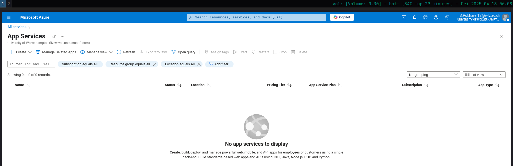
Creating a new App Service instance on Azure.

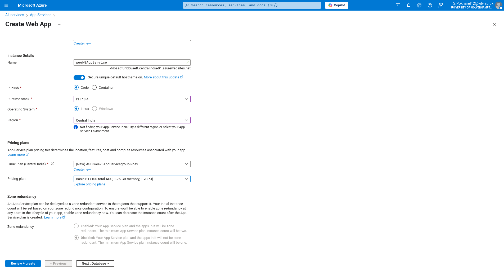
Filling out the configuration details for the App Service.


Running validation checks before creating the service.

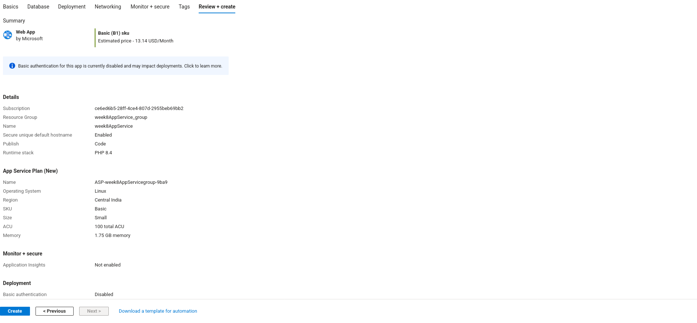
Azure confirms the settings are valid and ready for deployment.


Starting deployment process to Azure App Service.

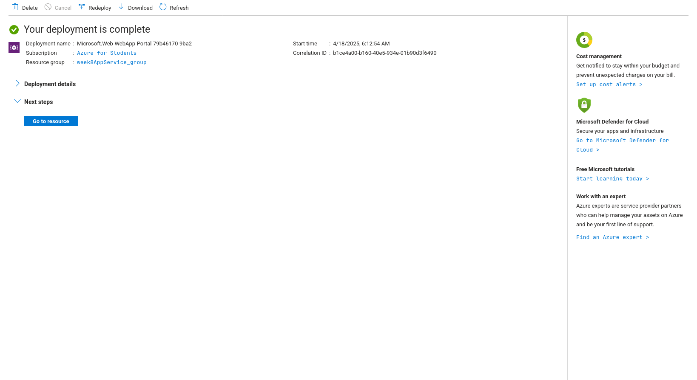
Deployment completed successfully. App is now live.

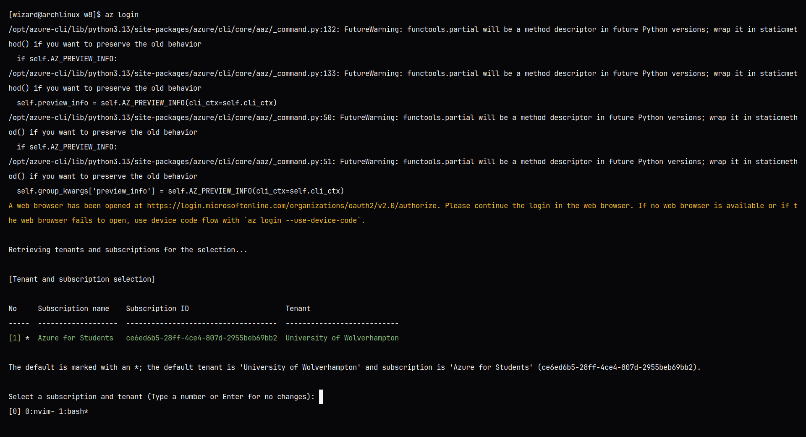
Logging into Azure via CLI to prep for app deployment.

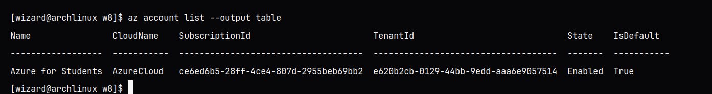
Successfully logged in and connected to Azure subscription.


Zipping the PHP project folder before pushing it to Azure.

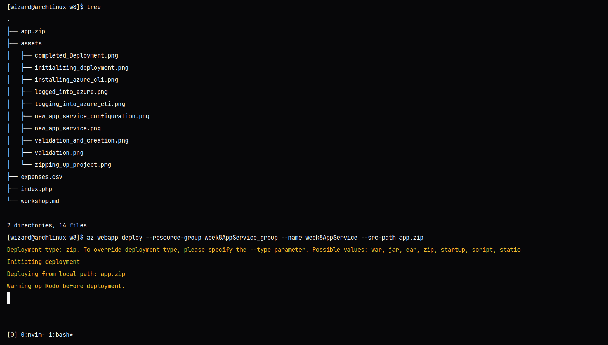
Deploying the zipped PHP app using Azure CLI commands.

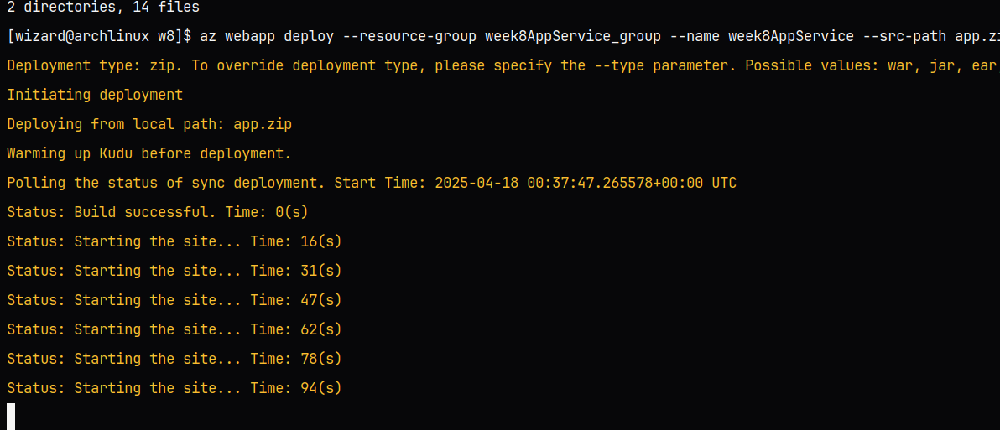
Deployment in progress... Azure doing its thing.

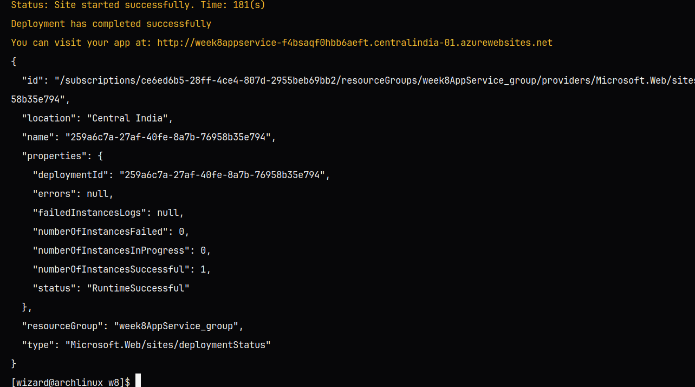
App is up and running! Deployment finished without issues.

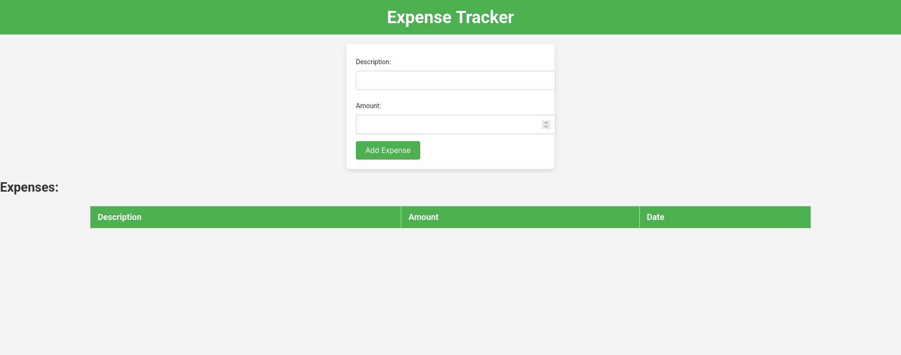
Live expense tracker showing the form and previous entries.

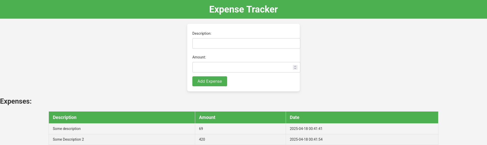
After page reload; data persistence.
