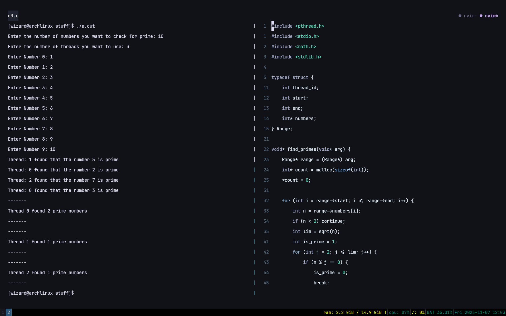
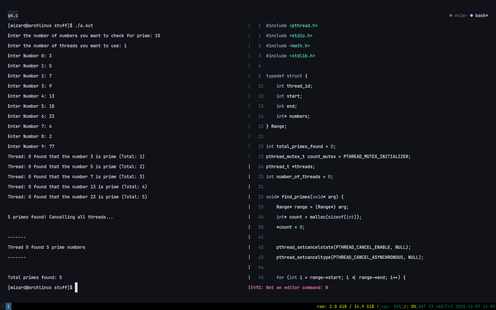
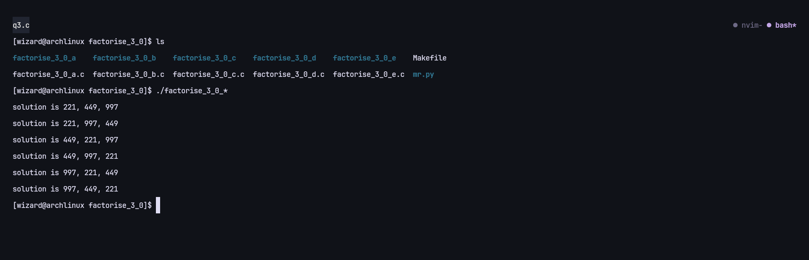
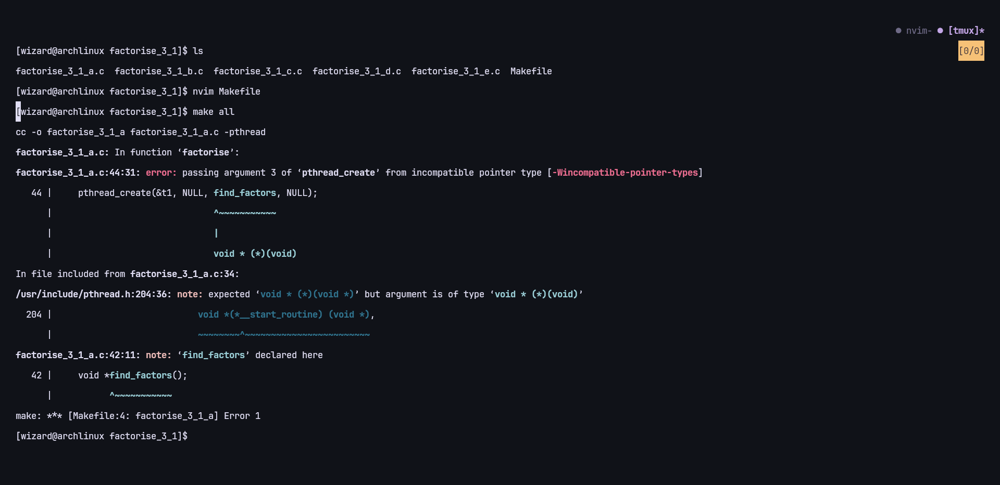
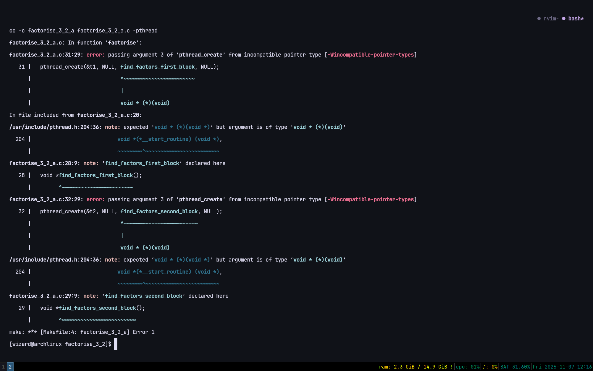

==Student Number: 2431342==
==Name: Swoyam Pokharel==


#### Write a multithreaded C program to print out all the prime numbers between 1 and 10000. Use exactly 3 threads.

```c
#include <pthread.h>
#include <stdio.h>
#include <math.h>

typedef struct {
    int start;
    int end;
}  Range;


void* find_primes(void* arg) {
    Range* range = (Range*) arg;

    for (int n = range->start; n <= range->end; n++) {
        if (n < 2) continue;

        int lim = sqrt(n);
        int is_prime = 1;
        for (int i = 2; i <= lim; i++) {
            if (n % i == 0) {
                is_prime = 0;
                break;
            }
        }

        if (is_prime)
            printf("%d is prime\n", n);
    }

    return NULL;
}

int main(){
    pthread_t threads[3];
    Range ranges[3];

    int numbers_per_thread = 10000 / 3;

    for (int i = 0; i < 3; i++) {
        ranges[i].start = i * numbers_per_thread + 1;
        // If last thread, just take up the rest that's remaining
        ranges[i].end = (i == 3 - 1)? 10000 : (i + 1) * numbers_per_thread;
    }


    for (int i = 0; i < 3; i++) {
        pthread_create(&threads[i], NULL, find_primes, &ranges[i]);
    }

    for (int i = 0; i < 3; i++) {
        pthread_join(threads[i], NULL);
    }

    return 0;

}
```

2. Convert this program to prompt the user for a number and then to create the number of threads the user has specified to find the prime numbers.

```c
#include <pthread.h>
#include <stdio.h>
#include <math.h>
#include <stdlib.h>

typedef struct {
    int thread_id;
    int start;
    int end;
    int* numbers;  
} Range;

void* find_primes(void* arg) {
    Range* range = (Range*) arg;
    for (int i = range->start; i <= range->end; i++) {
        int n = range->numbers[i];
        if (n < 2) continue;
        int lim = sqrt(n);
        int is_prime = 1;
        for (int j = 2; j <= lim; j++) {
            if (n % j == 0) {
                is_prime = 0;
                break;
            }
        }
        if (is_prime)
            printf("Thread: %d found that the number %d is prime\n", range->thread_id, n);
    }
    return NULL;
}

int main() {
    int number_of_numbers = 0, number_of_threads = 0;
    printf("Enter the number of numbers you want to check for prime: ");
    scanf("%d", &number_of_numbers);
    printf("Enter the number of threads you want to use: ");
    scanf("%d", &number_of_threads);
    
    Range *ranges = malloc(number_of_threads * sizeof(Range));
    int *numbers = malloc(number_of_numbers * sizeof(int));  // FIXED: allocate based on number_of_numbers
    pthread_t *threads = malloc(number_of_threads * sizeof(pthread_t));
    
    for (int i = 0; i < number_of_numbers; i++) {
        printf("Enter Number %d: ", i);
        scanf("%d", &numbers[i]);
    }
    
    int numbers_for_each_thread = number_of_numbers / number_of_threads;
    
    // Make Ranges
    for (int i = 0; i < number_of_threads; i++) {
        int start = numbers_for_each_thread * i;
        int end = (i == number_of_threads - 1) ? number_of_numbers - 1 : numbers_for_each_thread * (i + 1) - 1;
        ranges[i] = (Range){i, start, end, numbers};  // Pass the numbers array
    }
    
    // Assign Threads
    for (int i = 0; i < number_of_threads; i++) {
        pthread_create(&threads[i], NULL, find_primes, (void *) &ranges[i]);
    }
    
    // Wait for em to finish
    for (int i = 0; i < number_of_threads; i++) {
        pthread_join(threads[i], NULL);
    }
    
    free(ranges);
    free(threads);
    free(numbers);
}
```

3. Convert the program in (2) so that each thread returns the number of prime numbers that it has found using pthread_exit() and for main program to print out the number of prime number that each thread has found.


```c
#include <pthread.h>
#include <stdio.h>
#include <math.h>
#include <stdlib.h>

typedef struct {
    int thread_id;
    int start;
    int end;
    int* numbers;  
} Range;

void* find_primes(void* arg) {
    Range* range = (Range*) arg;
    int* count = malloc(sizeof(int));  
    *count = 0;
    
    for (int i = range->start; i <= range->end; i++) {
        int n = range->numbers[i];
        if (n < 2) continue;
        int lim = sqrt(n);
        int is_prime = 1;
        for (int j = 2; j <= lim; j++) {
            if (n % j == 0) {
                is_prime = 0;
                break;
            }
        }
        if (is_prime) {
            printf("Thread: %d found that the number %d is prime\n", range->thread_id, n);
            (*count)++;
        }
    }
    pthread_exit((void*) count);
}

int main() {
    int number_of_numbers = 0, number_of_threads = 0;
    printf("Enter the number of numbers you want to check for prime: ");
    scanf("%d", &number_of_numbers);
    printf("Enter the number of threads you want to use: ");
    scanf("%d", &number_of_threads);
    
    Range *ranges = malloc(number_of_threads * sizeof(Range));
    int *numbers = malloc(number_of_numbers * sizeof(int));  
    pthread_t *threads = malloc(number_of_threads * sizeof(pthread_t));
    
    for (int i = 0; i < number_of_numbers; i++) {
        printf("Enter Number %d: ", i);
        scanf("%d", &numbers[i]);
    }
    
    int numbers_for_each_thread = number_of_numbers / number_of_threads;
    
    // Make Ranges
    for (int i = 0; i < number_of_threads; i++) {
        int start = numbers_for_each_thread * i;
        int end = (i == number_of_threads - 1) ? number_of_numbers - 1 : numbers_for_each_thread * (i + 1) - 1;
        ranges[i] = (Range){i, start, end, numbers};
    }
    
    // Assign Threads
    for (int i = 0; i < number_of_threads; i++) {
        pthread_create(&threads[i], NULL, find_primes, (void *) &ranges[i]);
    }
    
    // Wait for em to finish and get the results
    for (int i = 0; i < number_of_threads; i++) {
        int* count;
        pthread_join(threads[i], (void**) &count);
        printf("-------\n");
        printf("Thread %d found %d prime numbers\n", i, *count);
        printf("-------\n");
        free(count);  
    }
    
    free(ranges);
    free(threads);
    free(numbers);
}
```

Firstly, the program asks the user to input the numbers they want to check for prime, and the number of threads.  From the above versions, the main thing that is different here is the `count` field. Since each thread has it's own seperate `count`, mutex or atomic operations aren't really needed. Each thread checks it's specified range by callign the `find_primes` function, and when it encounters a prime number, it simply increments the `count` field. At the very end, we return the `count` using `pthread_exit`.

This later joins with the `main` function when we call the `pthread_join(threads[i], (void**) &count);` function, and get's printed to stdout from the main thread.




4. Convert the program in (3) to use pthread_cancel() to cancel all threads as soon as the 5th prime number has been found.

```c
#include <pthread.h>
#include <stdio.h>
#include <math.h>
#include <stdlib.h>

typedef struct {
    int thread_id;
    int start;
    int end;
    int* numbers;  
} Range;

int total_primes_found = 0;
pthread_mutex_t count_mutex = PTHREAD_MUTEX_INITIALIZER;
pthread_t *threads;
int number_of_threads = 0;

void* find_primes(void* arg) {
    Range* range = (Range*) arg;
    int* count = malloc(sizeof(int));  
    *count = 0;
    
    pthread_setcancelstate(PTHREAD_CANCEL_ENABLE, NULL);
    pthread_setcanceltype(PTHREAD_CANCEL_ASYNCHRONOUS, NULL);
    
    for (int i = range->start; i <= range->end; i++) {
        int n = range->numbers[i];
        if (n < 2) continue;
        int lim = sqrt(n);
        int is_prime = 1;
        for (int j = 2; j <= lim; j++) {
            if (n % j == 0) {
                is_prime = 0;
                break;
            }
        }
        if (is_prime) {
            pthread_mutex_lock(&count_mutex);
            total_primes_found++;
            printf("Thread: %d found that the number %d is prime (Total: %d)\n", 
                   range->thread_id, n, total_primes_found);
            (*count)++;
            
            // Check if we've found 5 primes
            if (total_primes_found >= 5) {
                printf("\n5 primes found! Cancelling all threads...\n\n");
                // Cancel all other threads
                for (int t = 0; t < number_of_threads; t++) {
                    if (threads[t] != pthread_self()) {
                        pthread_cancel(threads[t]);
                    }
                }
                pthread_mutex_unlock(&count_mutex);
                pthread_exit((void*) count);
            }
            pthread_mutex_unlock(&count_mutex);
        }
    }
    pthread_exit((void*) count);
}

int main() {
    int number_of_numbers = 0;
    printf("Enter the number of numbers you want to check for prime: ");
    scanf("%d", &number_of_numbers);
    printf("Enter the number of threads you want to use: ");
    scanf("%d", &number_of_threads);
    
    Range *ranges = malloc(number_of_threads * sizeof(Range));
    int *numbers = malloc(number_of_numbers * sizeof(int));  
    threads = malloc(number_of_threads * sizeof(pthread_t));
    
    for (int i = 0; i < number_of_numbers; i++) {
        printf("Enter Number %d: ", i);
        scanf("%d", &numbers[i]);
    }
    
    int numbers_for_each_thread = number_of_numbers / number_of_threads;
    
    // Make Ranges
    for (int i = 0; i < number_of_threads; i++) {
        int start = numbers_for_each_thread * i;
        int end = (i == number_of_threads - 1) ? number_of_numbers - 1 : numbers_for_each_thread * (i + 1) - 1;
        ranges[i] = (Range){i, start, end, numbers};
    }
    
    // Assign Threads
    for (int i = 0; i < number_of_threads; i++) {
        pthread_create(&threads[i], NULL, find_primes, (void *) &ranges[i]);
    }
    
    // Wait for em to finish and get the results
    for (int i = 0; i < number_of_threads; i++) {
        int* count;
        int result = pthread_join(threads[i], (void**) &count);
        
        if (result == 0 && count != NULL) {
            // Thread completed normally
            printf("-------\n");
            printf("Thread %d found %d prime numbers\n", i, *count);
            printf("-------\n");
            free(count);
        } else {
            // Thread was cancelled
            printf("-------\n");
            printf("Thread %d was cancelled\n", i);
            printf("-------\n");
        }
    }
    
    printf("\nTotal primes found: %d\n", total_primes_found);
    
    pthread_mutex_destroy(&count_mutex);
    free(ranges);
    free(threads);
    free(numbers);
}
```
The program asks the user for numbers and threads. Each thread checks its range for primes. When a thread finds a prime, it increments its own count and the global total_primes_found which is protected by a mutex to avoid race conditions, this can be swapped for an atomic operation if performance is critical.

As soon as the 5th prime is found, the thread cancels all other threads with `pthread_cancel()`. Threads that finish normally return their count via `pthread_exit()`. Threads that get cancelled are detected in main via `pthread_join()`, and we print which threads were cancelled and the total primes found.



---






```bash
.
├── assets
│   ├── make_1.png
│   ├── make_2.png
│   ├── make_3.png
│   ├── q3_out.png
│   └── q4_out.png
├── notes.md
├── stuff
│   ├── a.out
│   ├── q1.c
│   ├── q2.c
│   ├── q3.c
│   └── q4.c
├── threads-part-1
│   ├── factorise_3_0
│   │   ├── factorise_3_0_a
│   │   ├── factorise_3_0_a.c
│   │   ├── factorise_3_0_b
│   │   ├── factorise_3_0_b.c
│   │   ├── factorise_3_0_c
│   │   ├── factorise_3_0_c.c
│   │   ├── factorise_3_0_d
│   │   ├── factorise_3_0_d.c
│   │   ├── factorise_3_0_e
│   │   ├── factorise_3_0_e.c
│   │   ├── Makefile
│   │   └── mr.py
│   ├── factorise_3_1
│   │   ├── factorise_3_1_a.c
│   │   ├── factorise_3_1_b.c
│   │   ├── factorise_3_1_c.c
│   │   ├── factorise_3_1_d.c
│   │   ├── factorise_3_1_e.c
│   │   └── Makefile
│   ├── factorise_3_2
│   │   ├── factorise_3_2_a.c
│   │   ├── factorise_3_2_b.c
│   │   ├── factorise_3_2_c.c
│   │   ├── factorise_3_2_d.c
│   │   └── Makefile
│   ├── factorise_advanced
│   │   ├── factorise_3_4.c
│   │   ├── factorise_3_n.c
│   │   ├── factorise_4.c
│   │   ├── Makefile
│   │   └── mr.py
│   └── multiply
│       ├── Makefile
│       ├── multiply0.c
│       ├── multiply1.c
│       ├── multiply2.c
│       ├── multiply3.c
│       └── multiply4.c
└── week3_workshop.md

9 directories, 46 files
```
