## 1. Introduction
### 1.1 Usability

[^1]: https://www.nngroup.com/articles/return-on-investment-for-usability/
[^2]: https://www.businessdasher.com/statistics-about-website/
[^3]: https://www.businessdasher.com/web-design-statistics/

Usability: the degree to which something is able or fit to be used. - Oxford Dictionary

#### What is usability?
The word usability is the measure of how easy and intuitive something is to be used. It is also a concept very prevelant in UI/UX to ensure that products--like websites, native applications or games can be used as painlessly as possible. 

#### Why does it matter?
Usability matters because it is the single most important factor in user satisfication. Jakob Nielsen, one of the most recognized experts in UI/UX, emphasizes that allocating just 10% of a development budget to usability can yield significant returns. On average, **websites that undergo a usability revamp see a 135% imporvements in key performance metrics**.[^1]

#### How to make a website more usable?
Better usability can be acheived by following established frameworks such as:
- [Jakob Nielsen's Usability Heuristics](https://www.nngroup.com/articles/ten-usability-heuristics/)
- [Shneiderman’s Eight Golden Rules](https://www.cs.umd.edu/users/ben/goldenrules.html)
- [Web Content Accessibility Guidelines (WCAG)](https://www.wcag.com/)

Thus, in a world where there are 1.88 billion websites[^2], and where **the return on investment for UX design can reach 9,900%[^3]**, investing in usability is not just a gimmick but a necessity. A well designed, and user friendly website leads to **higher engagement, better conversion rates and overall user satisfication.** With this stated, the following section 
further explores existing research and studies on usability with a special focus in website usability.

## 2. Literature Review

### 2.1 Academic Research on Usability
- Discuss at least **two** usability-related academic journal articles.
- Summarize their key findings.
- Relate these findings to web usability.

### 2.2 Usability in Web Design
- Discuss general web usability best practices.
- Reference established frameworks or guidelines (Nielsen, Shneiderman, WCAG, etc.).

### 2.3 Overview of Selected Learning Management Platforms
In this report, we will be analysing 2 learning management platforms, namely [My Second Teacher](https://app.mysecondteacher.com.np/) and [Canvas](https://canvas.wlv.ac.uk/). These websites were chosen because as a student, these websites are the ones we mostly have to work with.

## 3. Analysis
### 3.1 Exploration of [My Second Teacher](https://app.mysecondteacher.com.np/)
### Aesthetic & Minimalism  
| Bob Shneiderman | Jakob Nielsen |
|---|---|
| Efficient & Aesthetic | Aesthetic & Minimal Design |
| The design should be both visually appealing and functional, ensuring efficiency in user interaction. | The interface should be simple, free from unnecessary elements, and visually focused on essential tasks. |

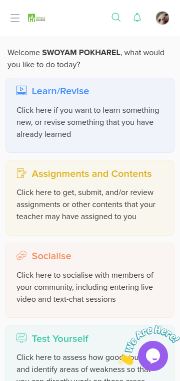

**Good:**  
- The design is clean looking, with a well thought out color pallete.
- The theme, typography and spacing is consistent. 
- Effective use of white space enhansing readability.
- There is no clutter, and all the UI elements focus on essential tasks that a user might do.
- The design is consistent across both mobile and desktop.

Overall, the design is clean, consistent, and free from clutter, aligning well with Aesthetic & Minimalism. Removing the "We Are Here" callout on mobile would further enhance simplicity.

---

### User Control & Freedom  

| Bob Shneiderman | Jakob Nielsen |
|---|---|
| User in Control | User Control & Freedom |
| Users should feel in control of their actions, with the ability to initiate and correct them easily. | Users should always have options to undo, redo, or exit actions without being stuck. |

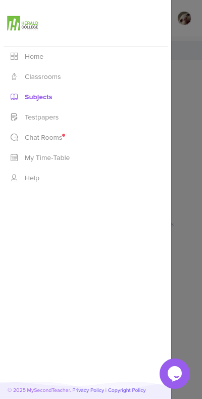

#### Things To Look Out For:
- Availability of undo, redo, and exit options  
- Easy navigation and ability to return to previous states  
- No forced actions (e.g., auto-submitting forms without confirmation)  
- Clear and accessible settings/preferences  

**Good:**  
- Easy navigation with the tab based layout on desktop, and hamburger menu on smaller screens.
- The settings and preferences are clearly accessible via the profile page.
- There are no forced actions

Overall, the platform aligns well with User Control & Freedom, offering easy navigation, accessible settings, and no forced actions, with no notable improvements needed.

---

### Easy Recovery & Error Handling  

| Bob Shneiderman | Jakob Nielsen |
|---|---|
| Easy to Reverse Actions | Help Users Recognize, Diagnose, & Recover from Errors |
| Users should have a way to undo mistakes without major consequences. | When errors occur, users should receive clear feedback and instructions on how to fix them. |

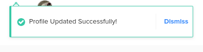
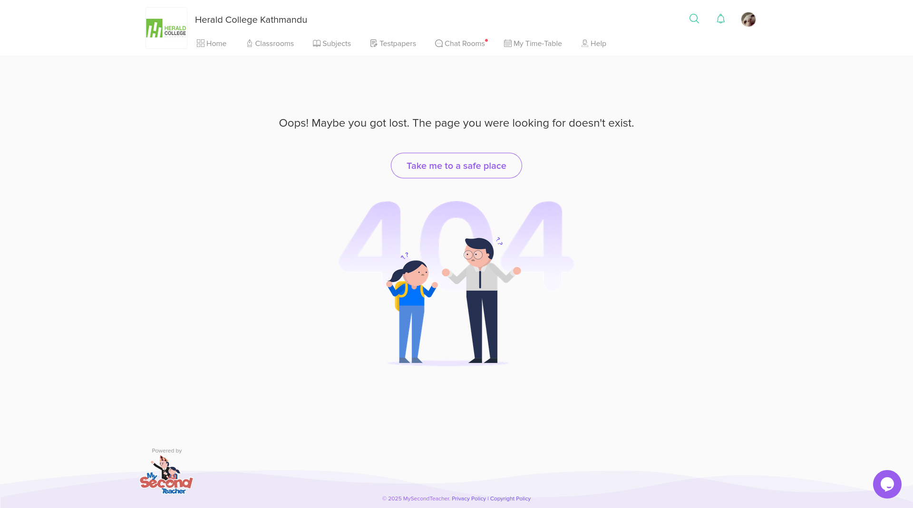
**Good:**  
- Clear error messages with actionable solutions.
- Visiting an invalid URL, provides a clear error message, that allows the user to go back with the `Take me to a safe place` button.

**Bad:**  
- There is no auto-saving feature to prevent data loss.
- The inavailability of undo or redo actions.

Overall, the platform aligns well with Easy Recovery & Error Handling, providing clear error messages and recovery options. However, adding auto-save and replacing "Dismiss" with an "Undo" option after saving would improve usability.

---

### Error Prevention  

| Bob Shneiderman | Jakob Nielsen |
|---|---|
| Prevent Errors Like a Pro | Error Prevention |
| Design should minimize the chance of user mistakes by guiding them correctly. | Systems should be built to prevent errors before they happen through validation and constraints. |

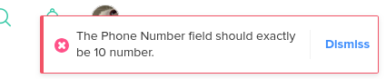
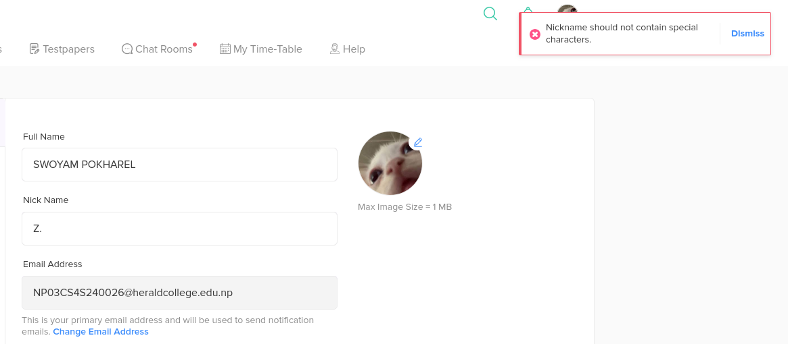

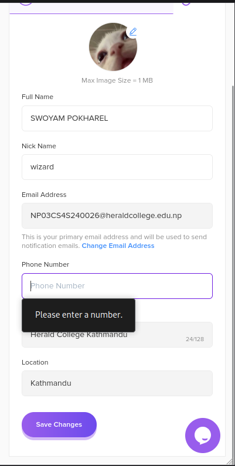
#### Things To Look Out For:
- Confirmation dialogs before critical actions (e.g., deleting accounts)  
- Input validation to prevent incorrect data submission  
- Limited destructive actions (e.g., irreversible deletions)  
- Warnings before proceeding with risky actions  

**Good:**  
- Input validation in place to prevent incorrect data submissions.
- There aren't any irreversible destructive actions available, such as deleting your own account.

**Bad:**
- No Confirmation dialog when logging out.

Overall, the platform aligns well with Error Prevention, with input validation and no irreversible actions. However, adding a confirmation dialog for logging out would prevent accidental clicks.

---

### Reduce Cognitive Load  
| Bob Shneiderman | Jakob Nielsen |
|---|---|
| Minimal Memory Load | Recognition Over Recall |
| Users should not have to remember complex details; the UI should assist them. | The system should make options visible and easy to recognize instead of requiring users to recall information. |

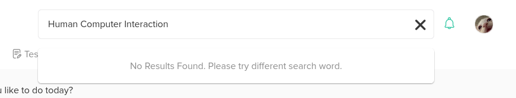

#### Things To Look Out For:
- Icons and labels that clearly indicate their function  
- Predictable navigation patterns  
- Auto-fill and suggestion features  
- No need to remember complex commands or sequences  

**Good:**  
- There are well recognized icons and labels to clearly indicate their respective functions.
- There are clear lables in input fields.
- Navigation patterns are predictable.

**Bad:**  
- Disregarding the fact that the search functionality doesn't work, it also doesn't provide auto-fill and suggestion.

Overall, the platform follows the principle of reducing cognitive load well, with clear icons, labels, and predictable navigation. A key improvement would be adding auto-fill and suggestion features in search to enhance usability.

---

### Speed & Efficiency  

| Bob Shneiderman | Jakob Nielsen |
|---|---|
| Shortcuts for Pros | Flexibility & Efficiency |
| Experienced users should have faster ways to complete tasks, like shortcuts. | The system should cater to both beginners and experts by allowing customization and efficiency tools. |

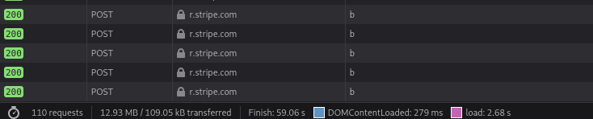

**Good:**  
- No unnecessary delays, with excessive animations.
- The website loads quick, loading in an average of < 3 seconds

**Bad:**  
- There is no website built keyboard shortcut in place. Furthermore, even shortcuts that should've been global across all websites (browser's undo/redo) is inconsistent.
- Although search bar does exist, it doesn't work.
- There aren't any customizable settings particularly in place to enhance workflow

Overall, the platform performs well in terms of Speed & Efficiency with quick load times and minimal delays. However, improvements can be made by adding keyboard shortcuts, ensuring search functionality works, and providing customizable settings to enhance workflow.

---

### Clear Feedback & System Status  

| Bob Shneiderman | Jakob Nielsen |
|---|---|
| Good Feedback, Fast | Visibility of System Status |
| The system should provide immediate and clear feedback on user actions. | Users should always know what is happening through real-time status indicators. |

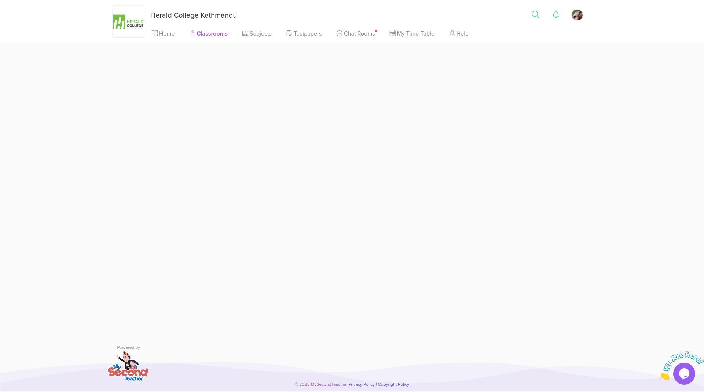

**Good:**  
- Existence of system status indicators such as "saved successfully"
- Notification message for completed or failed actions
- Instant visual feedback on user actions with button press effects

**Bad:**  
- Lack of loading indicators entirely.

Overall, the platform aligns well with Clear Feedback & System Status, providing status indicators and instant feedback on user actions. However, adding loading indicators would improve the user experience, especially in poor network conditions.

---

### Consistency  

| Bob Shneiderman | Jakob Nielsen |
|---|---|
| Consistency is Key | Consistency & Standards |
| Elements should behave predictably and follow a uniform design. | The system should align with established design patterns and not force users to learn new behaviors. |

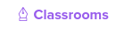
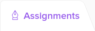

**Good:**  
- The UI elements for the most part are uniform across the entire website. 
- The website adheres to common design conventions, (profile notifications and search on top right).
- The website does't have any conflicting styles across the pages.

**Bad:**  
- The browser's undo/redo buttons don't always work correctly across tabs.
    - Example: Navigating from `Home` to `Classrooms` and pressing the browser's `Go-Back` button, doesn't return the user back to `Home`. 
    - However if the order is reversed and go from `Classrooms` to `Home` then the `Go-Back` button, works as expected.
- The search doesn't work as expected.
    - Example: Even though, we have `Human Computer Interaction` as a subject we are enrolled in, the search fails to find it.
- The icons for the classroom and assignment is the same.

Overall, the platform aligns well with Consistency & Standards, maintaining a uniform design and following common conventions. However, issues like inconsistent browser undo/redo behavior, non-functional search, and duplicate icons need attention for better consistency.

---

### Match Between System & Real World (Nielsen Only)  

| Jakob Nielsen |
|:---:|
| Match Between System & Real World |
| The interface should use familiar language, concepts, and symbols that reflect real-world experiences. |

#### Things To Look Out For:
- Use of real-world metaphors (e.g., trash can for delete)  
- Simple, user-friendly language instead of technical jargon  
- Intuitive icons and labels  
- Actions that mirror real-world expectations  

**Good:**  
- Use of real-world metaphors (classrooms, subjects, testpapers)
    - Icons of these labels also reflect real world objects, with `testpapers`, `subjects` encorporating icons that reflect their realworld counterparts
- Simple, user-friendly language instead of technical jargon  

Overall, the platform aligns well with Match Between System & Real World, using familiar metaphors (like classrooms, subjects, and test papers) and intuitive icons that reflect real-world objects. The language is simple and user-friendly, avoiding technical jargon.

---

### Help & Documentation (Nielsen Only)  

| Jakob Nielsen |
|:---:|
| Help & Documentation |
| Help should be easy to find and use when users need guidance. |

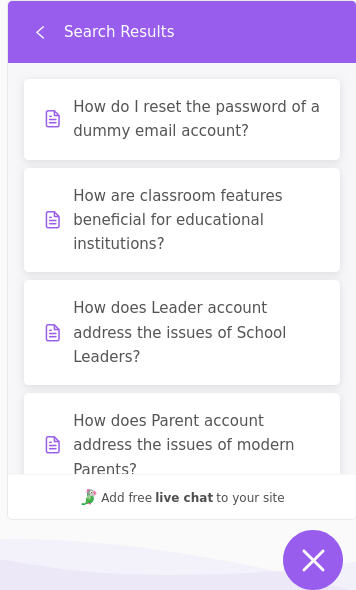

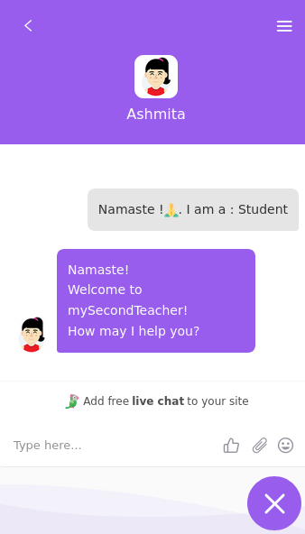
#### Things To Look Out For:
- Easily accessible help sections (FAQs, tooltips, documentation)  
- Searchable support resources  
- Contextual guidance (e.g., inline tips for forms)  
- Clear onboarding instructions for new users  

**Good:**  
- Easy accessible help sections
    - Very accessible FAQ section, with searchable questions
- Real time communication with an human representative

Overall, the platform provides easy access to help and documentation, with a searchable FAQ section and real-time communication with friendly human representatives. The guidance is clear, making it easy for users to get assistance when needed.

### 3.2 Exploration of [Wikipedia](https://www.wikipedia.org/)
### Aesthetic & Minimalism  

| Bob Shneiderman | Jakob Nielsen |
|:---:|:---:|
| Efficient & Aesthetic | Aesthetic & Minimal Design |
| The design should be both visually appealing and functional, ensuring efficiency in user interaction. | The interface should be simple, free from unnecessary elements, and visually focused on essential tasks. |

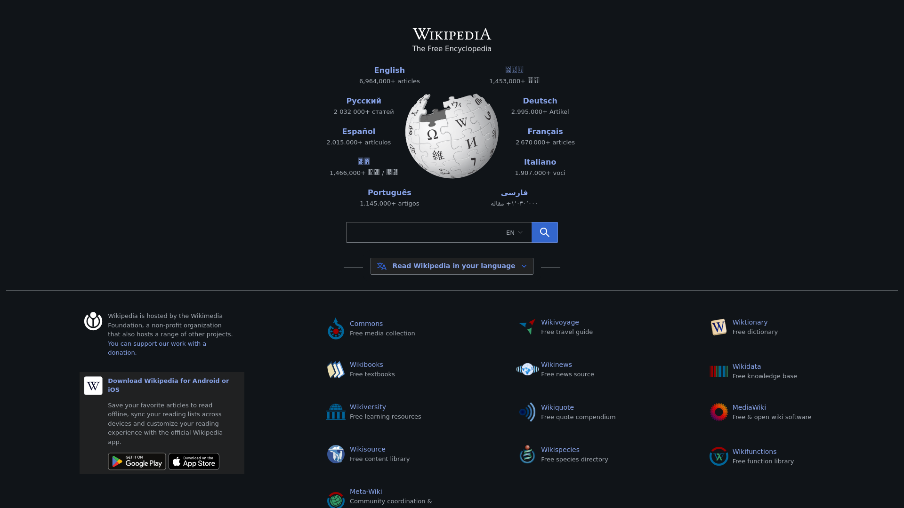
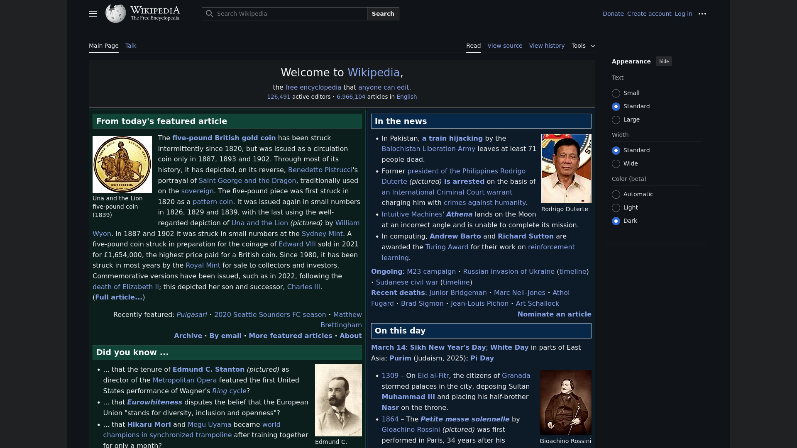

#### Things To Look Out For:
- Consistency in theme, colors, typography, and spacing  
- Avoidance of unnecessary elements (clutter-free design)  
- Proper use of white space for readability  
- Clear hierarchy and focus points  
- Responsive and adaptive design across devices  

**Good:**  
- Consistent theme, typography and colors across the page.
- No excessive animations or unnecessary elements

**Bad:**  
- Not fully responsive, making navigation on smaller screens difficult
- Cluttered layout with dense text and too many links.
- Poor use of white space, leading to a visually overwhelming experience

Overall, Wikipedia prioritizes function over aesthetics, maintaining a consistent, but cluttered design. A more responsive layout, improved spacing and better visual hierarchy could enhance usability without sacrificing the density of information.

---

### User Control & Freedom  
| Bob Shneiderman | Jakob Nielsen |
|:---:|:---:|
| User in Control | User Control & Freedom |
| Users should feel in control of their actions, with the ability to initiate and correct them easily. | Users should always have options to undo, redo, or exit actions without being stuck. |

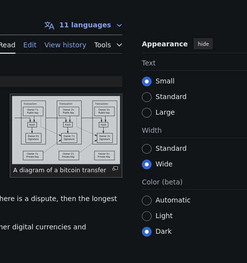

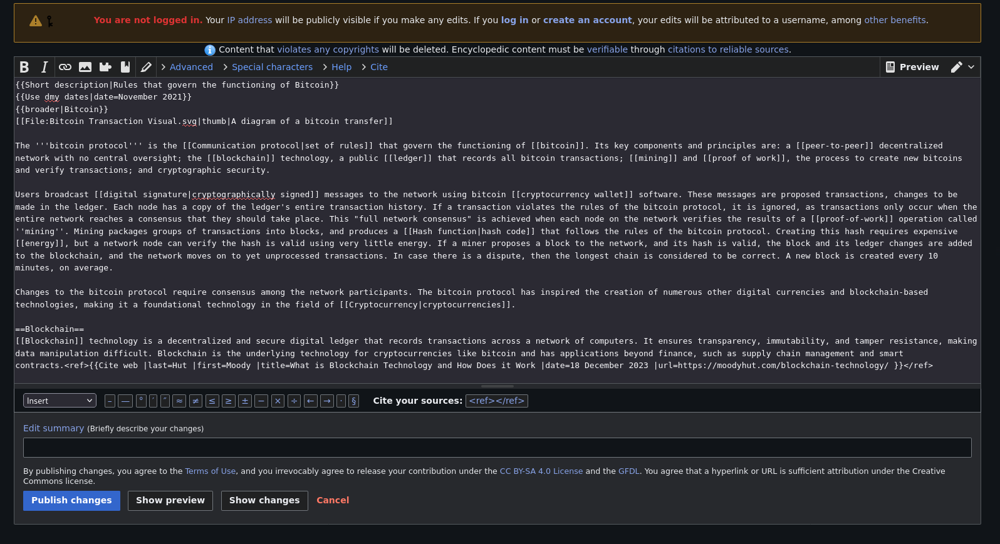
#### Things To Look Out For:
- Availability of undo, redo, and exit options  
- Easy navigation and ability to return to previous states  
- No forced actions (e.g., auto-submitting forms without confirmation)  
- Clear and accessible settings/preferences  

**Good:**  
- Wikipedia allows users to navigate back and forth using the browser's navigation buttons
- Very accessible preferences allowing user to change text sizes, the width of the page and the website's color
- Most pages in wikipedia support various languages

**Bad:**  
- No built in undo/redo for text edits. 
- Lacks quick navigation between frequently accessed pages

Overall, Wikipedia offers control for content revision but lacks undo/redo features within the editor, making error recovery more difficult.

---

### Easy Recovery & Error Handling  

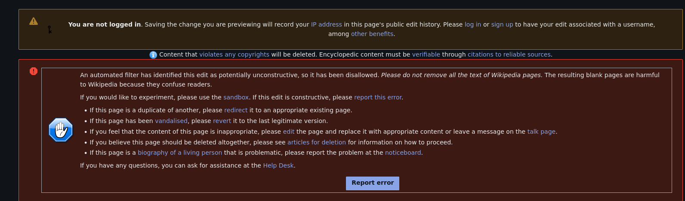
| Bob Shneiderman | Jakob Nielsen |
|:---:|:---:|
| Easy to Reverse Actions | Help Users Recognize, Diagnose, & Recover from Errors |
| Users should have a way to undo mistakes without major consequences. | When errors occur, users should receive clear feedback and instructions on how to fix them. |

#### Things To Look Out For:
- Presence of an undo/redo function  
- Clear error messages with actionable solutions  
- Highlighting where errors occur (e.g., form validation highlights)  
- Auto-saving drafts to prevent data loss  

**Good:**  
- Wikipedia's revision history allows users to revert edits very easily.
- Error messages during editing (e.g., conflicting edits) provide clear explanations.

**Bad:**  
- No auto save feature
- No inline error highlighting 
- Lacks real time warnings.

Overall, Wikipedia provides good error recovery through revision history but lacks features like auto-save and realtime error indicators, which could improve user experience.

---

### Error Prevention  

| Bob Shneiderman | Jakob Nielsen |
|:---:|:---:|
| Prevent Errors Like a Pro | Error Prevention |
| Design should minimize the chance of user mistakes by guiding them correctly. | Systems should be built to prevent errors before they happen through validation and constraints. |

#### Things To Look Out For:
- Confirmation dialogs before critical actions (e.g., deleting accounts)  
- Input validation to prevent incorrect data submission  
- Limited destructive actions (e.g., irreversible deletions)  
- Warnings before proceeding with risky actions  

**Good:**  
- Wikipedia prevents accidental deletions by requiring confirmation before making major edits.
- Input validation ensures proper formatting in citations and links.
- Protected pages prevent unauthorized edits to critical articles.

**Bad:**  
- No confirmation dialog before leaving an unfinished edit, which can lead to accidental loss of work.
- No warning when removing large sections of content, which could be accidental.

Overall, Wikipedia does well in preventing errors by requiring confirmation for major edits and using input validation. However, it lacks warnings when leaving an unfinished edit or deleting large content, which could lead to accidental mistakes.

---

### Reduce Cognitive Load  

| Bob Shneiderman | Jakob Nielsen |
|:---:|:---:|
| Minimal Memory Load | Recognition Over Recall |
| Users should not have to remember complex details; the UI should assist them. | The system should make options visible and easy to recognize instead of requiring users to recall information. |

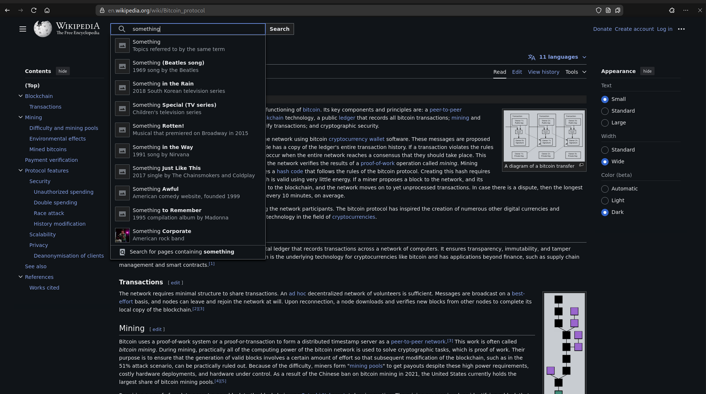

#### Things To Look Out For:
- Icons and labels that clearly indicate their function  
- Predictable navigation patterns  
- Auto-fill and suggestion features  
- No need to remember complex commands or sequences  

**Good:**  
- Clear labels and intuitive navigation makes it easy to explore content.
- Well-structured articles with headings, summaries, and links aid readability.
- Auto-fill feature in search bar
- Intuitive Table Of Contents on the side bar

**Bad:**  
- High information density in some articles can feel overwhelming. Improving line spacing and word spacing could enhance readability.

Wikipedia does a good job of reducing cognitive load by making content easy to navigate and search. However, enhancing readability with better spacing would make the experience even more user-friendly. While Wikipedia is meant to be packed with information, improving line and word spacing can enhance readability without losing any of that valuable content.

---

### Speed & Efficiency  

| Bob Shneiderman | Jakob Nielsen |
|:---:|:---:|
| Shortcuts for Pros | Flexibility & Efficiency |
| Experienced users should have faster ways to complete tasks, like shortcuts. | The system should cater to both beginners and experts by allowing customization and efficiency tools. |

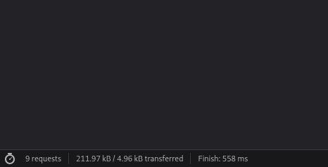
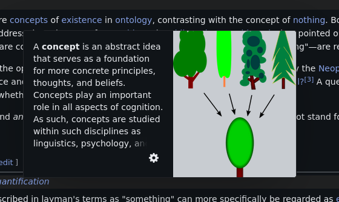

#### Things To Look Out For:
- Availability of keyboard shortcuts  
- Customizable settings to enhance workflow  
- Efficient navigation (e.g., search bars, quick actions)  
- No unnecessary delays (e.g., excessive animations, loading times)  

**Good:**  
- Very fast load time averaging < 1s
- Efficient navigation through the search bar and well-organized content.

**Bad:**  
- There are no significant keyboard shortcuts for experienced users to speed up navigation.

Wikipedia performs well in terms of speed and efficiency, with fast load times and well thought out navigation. However, it lacks shortcuts and customization features that would enhance the experience for more advanced users. 

---

### Clear Feedback & System Status  

| Bob Shneiderman | Jakob Nielsen |
|:---:|:---:|
| Good Feedback, Fast | Visibility of System Status |
| The system should provide immediate and clear feedback on user actions. | Users should always know what is happening through real-time status indicators. |

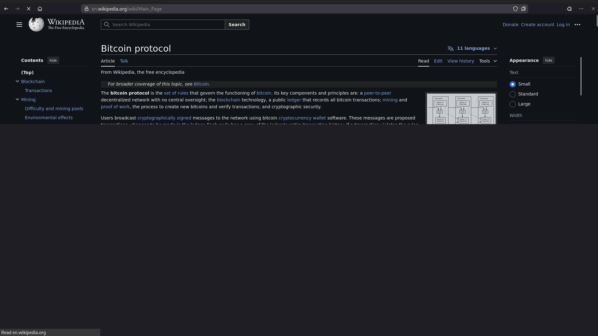

#### Things To Look Out For:
- Loading indicators, progress bars, or confirmation messages  
- Instant visual feedback on user actions (e.g., button press effect)  
- System status indicators (e.g., “Saving...”, “Processing...”)  
- Notification messages for completed or failed actions  

**Good:**  
- Clear feedback when actions are completed (e.g., "saved" or "search results").
- Intuitive tooltips on hover.

**Bad:**  
- Lack of loading indicator or progress bars
- No real time status indicator when editing a page
---

### Consistency  

| Bob Shneiderman | Jakob Nielsen |
|:---:|:---:|
| Consistency is Key | Consistency & Standards |
| Elements should behave predictably and follow a uniform design. | The system should align with established design patterns and not force users to learn new behaviors. |

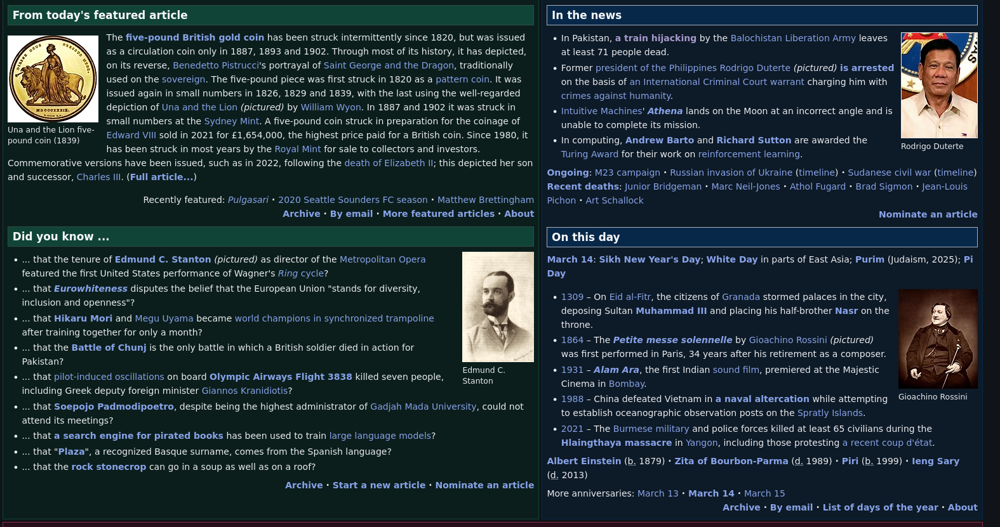

#### Things To Look Out For:
- Uniform UI elements (buttons, forms, typography)  
- Predictable interaction patterns  
- Adherence to common design conventions (e.g., close button on top-right)  
- No conflicting styles across different pages  

**Good:**  
- Consistent design across the pages, with uniform typography, buttons and layout
- Predictable interaction patterns (intuitive links, proper navigation, predictable search)

**Bad:**  
- Some pages show inconsistencies over the tradational "wikipedia feel"

Overall, Wikipedia largely has followed consistent design principles. However, minor inconsistencies in layout for different types content it presents.

---

### Match Between System & Real World (Nielsen Only)  

| Jakob Nielsen |
|:---:|
| Match Between System & Real World |
| The interface should use familiar language, concepts, and symbols that reflect real-world experiences. |

#### Things To Look Out For:
- Use of real-world metaphors (e.g., trash can for delete)  
- Simple, user-friendly language instead of technical jargon  
- Intuitive icons and labels  
- Actions that mirror real-world expectations  

**Good:**  
- User-friendly language is used throughout the interface, with minimal jargon, making it easy to understand.
- Icons like magnifying glass for searching, highlighter icon, etc reflect real-world concepts.

**Bad:**  
- Some technical terms may still be used in specialized articles, which can confuse non-experts. For example, articles related to scientific topics may use jargon that is harder for a general audience to understand.

Overall, Wikipedia generally aligns well with real-world metaphors and uses simple, recognizable icons. However, some specialized topics may require a more simplified approach for wider understanding. 
