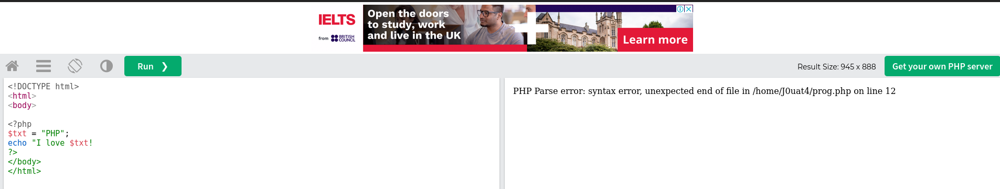
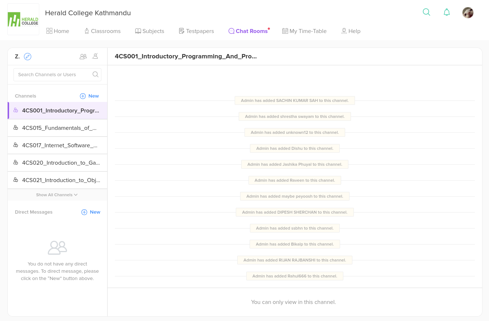
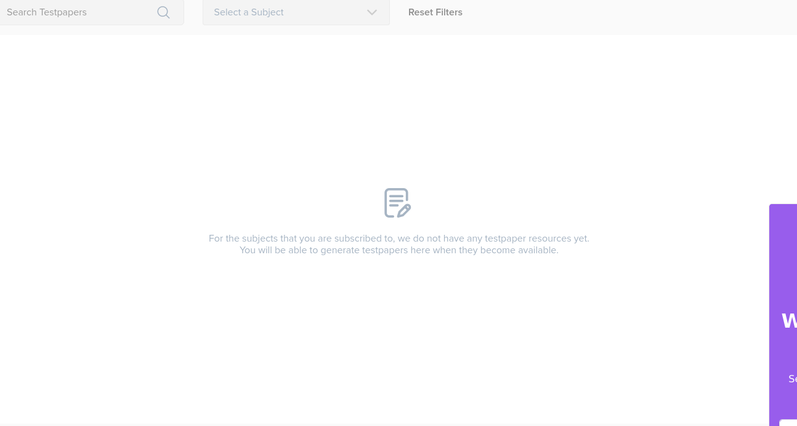
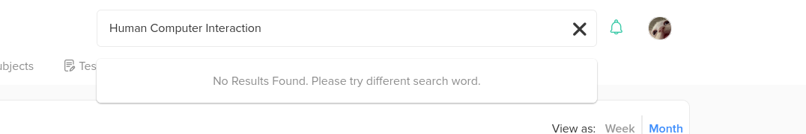

# Shneiderman’s 8 Golden Rules of Interface Design
- Consistency is key.
- Shortcuts for pros.
- Good Feedback, fast.
- Prevent errors: design so mistakes dont happen. Delete > conformation popups > prevents screwing up
- Easy to reverse actions:  people mess up. make it easy to undo
- User in control 
- Minimal Memory Load
- Efficient & Aesthetic

# Jakob Nielsen’s 10 Usability Heuristics
- Visibility of System Status:  Keep users in loop. Loading? Show progress; Processing? show spinner
- Match Between System & Real World: ditch tech jargon; Speak Human
- User Control & freedom: give escape routes. undo, redo, back buttons 
- Consistency & Standards : Don't Reinvent UI Patterns. 
- Error Prevention: Bet way to fix errors is to simply not let them happen
- Recognition Over Recall
- Flexibility & Effeciency
- Aesthetic & Minimal Design
- Help users Recocnize, Diagnose & Recover from Errors
- Help & Documentation

---

# Shneiderman & Nielsen's Usability Rules 🔥  

## Aesthetic & Minimalism  
- **Shneiderman:** Efficient & Aesthetic – Keep it clean, simple, and functional.  
- **Nielsen:** Aesthetic & Minimalist Design – No clutter, every element should serve a purpose.  

## User Control & Freedom  
- **Shneiderman:** User in Control – Let users decide what they want to do, don’t force them.  
- **Nielsen:** User Control & Freedom – Undo, redo, and exit options should always be there.  

## Easy Recovery & Error Handling  
- **Shneiderman:** Easy to Reverse Actions – Undo should be an option at all times.  
- **Nielsen:** Help Users Recognize, Diagnose, & Recover from Errors – Clear error messages, easy fixes.  

## Error Prevention  
- **Shneiderman:** Prevent Errors Like a Pro – Design in a way that avoids mistakes.  
- **Nielsen:** Error Prevention – Best way to fix errors? Make sure they never happen.  

## Reduce Cognitive Load  
- **Shneiderman:** Minimal Memory Load – Users shouldn’t have to remember things, UI should guide them.  
- **Nielsen:** Recognition Over Recall – Show options instead of making users remember.  

## Speed & Efficiency  
- **Shneiderman:** Shortcuts for Pros – Power users need hotkeys and efficiency hacks.  
- **Nielsen:** Flexibility & Efficiency – Adapt for both newbies and pros (shortcuts, automation).  

## Clear Feedback & System Status  
- **Shneiderman:** Good Feedback, Fast – Users should see instant responses to their actions.  
- **Nielsen:** Visibility of System Status – Keep users informed with progress indicators, load spinners, etc.  

## Consistency  
- **Shneiderman:** Consistency is Key – UI elements should be predictable and follow standard conventions.  
- **Nielsen:** Consistency & Standards – Don’t make users guess, follow existing design patterns.  

---

## Unique to Each  

### **Shneiderman Only**  
- **N/A** (Everything maps to Nielsen’s rules)  

### **Nielsen Only**  
- **Match Between System & Real World** – Speak human, not machine. Use familiar icons & language.  
- **Help & Documentation** – If users need help, make it easy to find (searchable docs, FAQs, tooltips).  

---

# Usability Review of Learning Websites  

# W3Schools  

### Good:
- **Visibility of System Status** – Instant feedback on button clicks, live code editor shows changes immediately.  
- **Recognition Over Recall** – Code examples are visible no need to memorize syntax ?
- **User Control & Freedom** – The "Try it Yourself" editor allows unlimited experimentation.  
- **Minimal Memory Load** – Step-by-step explanations and examples for concepts.

>
~
>

>

>
~
>
### Bad:
- **Aesthetic & Minimalist Design** – The site is functional, but visually outdated and cluttered.  
- **Flexibility & Efficiency** – No real shortcuts or advanced tools for power users.  
- **Error Prevention** – The live editor doesn’t warn about common mistakes; users just see errors.  

>

# MST

### Good:
- **User Control & Freedom** – They Have over 4000 interactive videos; user can pick; pause, rewind, playback ...
- **Good Feedback, Fast** – Interactive quizzes give instant results and diagnostics.
- **Match Between System & Real World** – The platform uses straightforward language and familiar educational structures, ensuring content is relatable and easy to understand.

>
~
>

>

>

>
~
>
### Bad:
- **Shortcuts for Pros** – No real way to speed up navigation or customize the learning experience.  
    - Search Doesn't Work
- **Error Prevention** – Some questions don't guide users on how to fix mistakes.  
- **Aesthetic & Minimalist Design** – The site is functional, but visually outdated and cluttered. Random Notifications. 
    - Unusable sections

