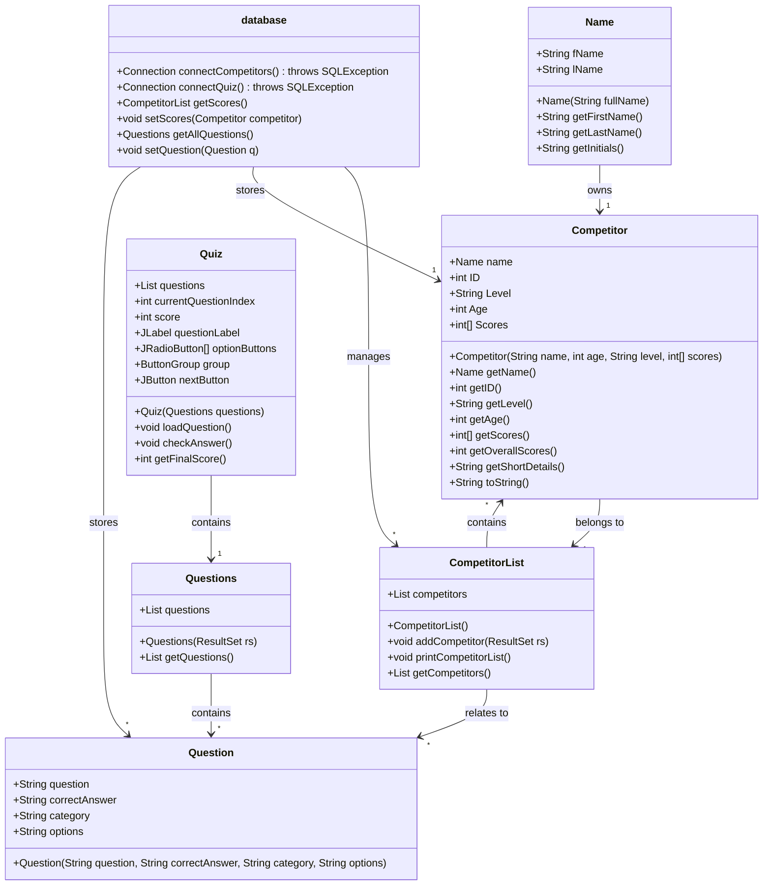

```mermaid
classDiagram
    class Name {
        +String fName
        +String lName
        +Name(String fullName)
        +String getFirstName()
        +String getLastName()
        +String getInitials()
    }

    class Competitor {
        +Name name
        +int ID
        +String Level
        +int Age
        +int[] Scores
        +Competitor(String name, int age, String level, int[] scores)
        +Name getName()
        +int getID()
        +String getLevel()
        +int getAge()
        +int[] getScores()
        +int getOverallScores()
        +String getShortDetails()
        +String toString()
    }

    class CompetitorList {
        +List<Competitor> competitors
        +CompetitorList()
        +void addCompetitor(ResultSet rs)
        +void printCompetitorList()
        +List<Competitor> getCompetitors()
    }

    class Question {
        +String question
        +String correctAnswer
        +String category
        +String options
        +Question(String question, String correctAnswer, String category, String options)
    }

    class Questions {
        +List<Question> questions
        +Questions(ResultSet rs)
        +List<Question> getQuestions()
    }

    class Quiz {
        +List<Question> questions
        +int currentQuestionIndex
        +int score
        +JLabel questionLabel
        +JRadioButton[] optionButtons
        +ButtonGroup group
        +JButton nextButton
        +Quiz(Questions questions)
        +void loadQuestion()
        +void checkAnswer()
        +int getFinalScore()
    }

    class database {
        +Connection connectCompetitors() throws SQLException
        +Connection connectQuiz() throws SQLException
        +CompetitorList getScores()
        +void setScores(Competitor competitor)
        +Questions getAllQuestions()
        +void setQuestion(Question q)
    }

    Name --> "1" Competitor : owns
    Competitor --> "1" CompetitorList : belongs to
    CompetitorList --> "*" Competitor : contains
    Quiz --> "1" Questions : contains
    Questions --> "*" Question : contains
    database --> "*" CompetitorList : manages
    database --> "1" Competitor : stores
    database --> "*" Question : stores
    CompetitorList --> "*" Question : relates to
```
