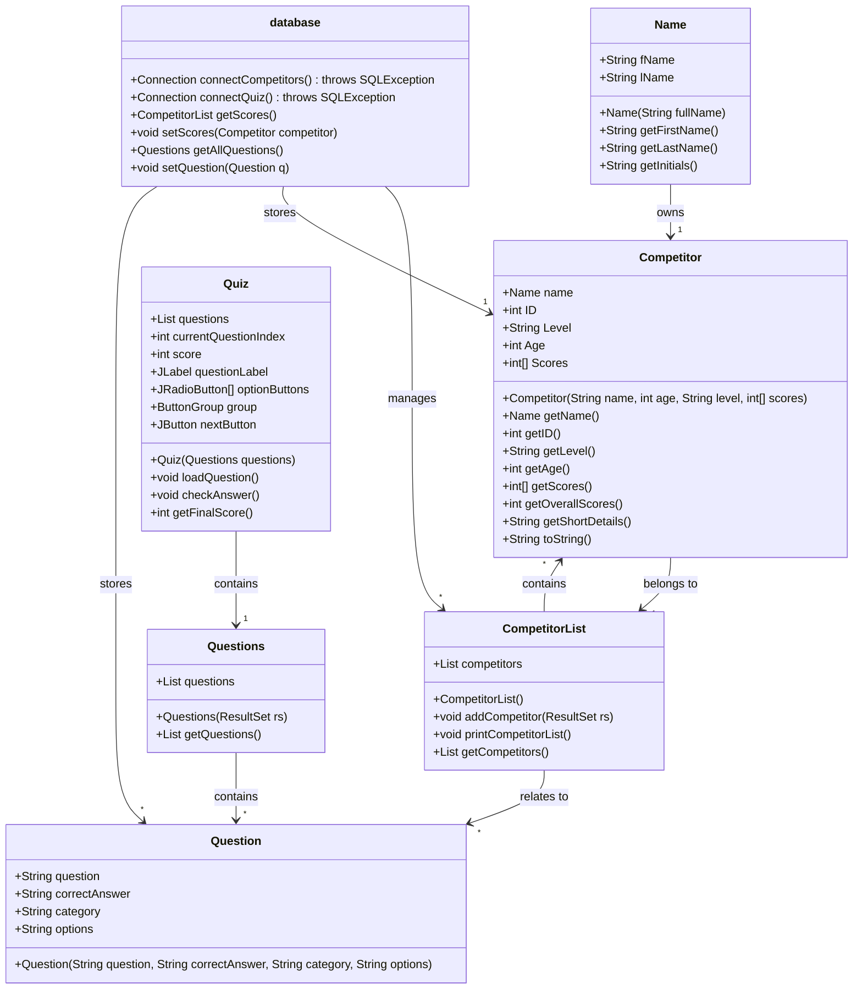

# Coursework Report

## 1. Introduction
This coursework focuses on developing a Java-based competitor management system with MySQL integration. The primary objective is to store, retrieve, and analyze competitor details, including scores, using a structured database approach. The expected outcome is a functional application capable of managing competitor records efficiently.

## 2. Methodology
The software development lifecycle followed for this project is the iterative model, allowing continuous testing and refinement. The key tools used include:
- **Java** for application development
- **MySQL** for database storage
- **JDBC** for database connectivity
- **JUnit** for unit testing
- **Swing** for GUI components

## 3. Implementation

### 3.1. Competitor Class Development
The `Competitor` class represents individual competitors with attributes such as name, age, level, and scores. Methods include:
- **getOverallScores()**: Computes the average score.
- **getShortDetails()**: Provides a summary including ID, initials, and score.
- **toString()**: Displays full competitor details.

### 3.2. MySQL and Arrays
The `Competitor` class was updated to handle arrays of scores using an integer array. The overall score is calculated by averaging all scores. 

The MySQL schema includes:
- `id` (Primary Key, INT)
- `Name` (VARCHAR)
- `Level` (VARCHAR)
- `Age` (INT)
- `Score1-Score5` (INT)

JDBC is used for database connectivity, allowing retrieval and insertion of competitor records.

### 3.3. MySQL Integration and Reports
Other classes interact with `Competitor` to generate reports. The `CompetitorList` class retrieves data and formats it for display, allowing the manager to view summaries or detailed reports.

### 3.4. Error Handling
- **Input validation**: Ensures correct data types and constraints.
- **Database connection handling**: Uses `try-catch` blocks to manage exceptions like `SQLException` and prevent crashes.
- **Invalid data handling**: Ensures missing or incorrect values are logged and handled gracefully.

### 3.5. Testing
Unit tests were implemented for:
- `Competitor.getOverallScores()` to ensure correct computation.
- `CompetitorList.addCompetitor()` to verify data parsing from `ResultSet`.
- Database connection tests to check JDBC operations.

## 4. Javadoc Comments
Javadoc comments were implemented for the `CompetitorList` class, covering class descriptions, method parameters, and return values to improve maintainability and documentation.

## 5. Class Diagram
A UML class diagram showcases relationships:
- `Competitor` has a one-to-many relationship with `CompetitorList`.
- `CompetitorList` interacts with the database via JDBC.
- `Manager` provides a UI interface for users.

## 6. Test Cases
| Test Case | Input | Expected Output |
|-----------|-------|----------------|
| Add Competitor | Valid data | Competitor added successfully |
| Calculate Overall Score | Scores: [10, 20, 30, 40, 50] | Overall Score = 30 |
| Invalid Age Input | Age = -5 | Error Message |
| Database Connection | Invalid credentials | Connection failure |

## 7. Status Report
The application meets most specifications, including database integration, competitor management, and reporting. Minor improvements are still required.

## 8. Known Bugs and Limitations
- GUI layout is minimal and could be enhanced.
- Limited input validation in certain fields.
- Error messages could be more user-friendly.

## 9. Conclusion
The coursework successfully implements a competitor management system using Java and MySQL. The project meets key requirements, though improvements can be made in GUI design and input validation for enhanced user experience.
