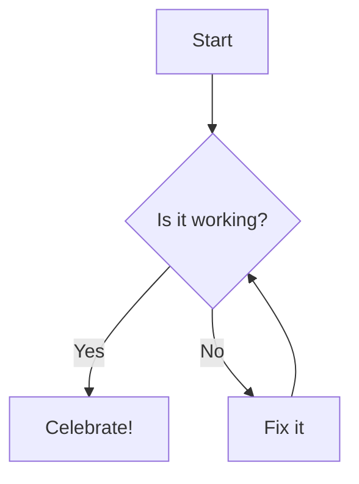

# Sem 5 Go BRRR


> [!WARNING]
> **Heads up:** This file uses Mermaid diagrams and custom callouts.

Here’s something ==important== to pay attention to.

::: warning
_Fortune favors the bold._
:::

::: info
_Fortune favors the bold._
:::

::: tip
_Fortune favors the bold._
:::

## Mermaid Diagram



```go
~

func main() {
    fmt.Println("Hello, Markdown!")
}


```
