# Running Queries:

### Creating Table:
```sql
~

CREATE TABLE IF NOT EXISTS buffer (
  name VARCHAR(255),
  brand VARCHAR(50),
  quantity INT,
  price DECIMAL(19, 2)
);

```

### Inserts:

##### Single:
```sql
~
INSERT INTO buffer (name, brand, quantity, price)
VALUES ('iPhone 14 Pro', 'Apple', 10, 999.99);
```

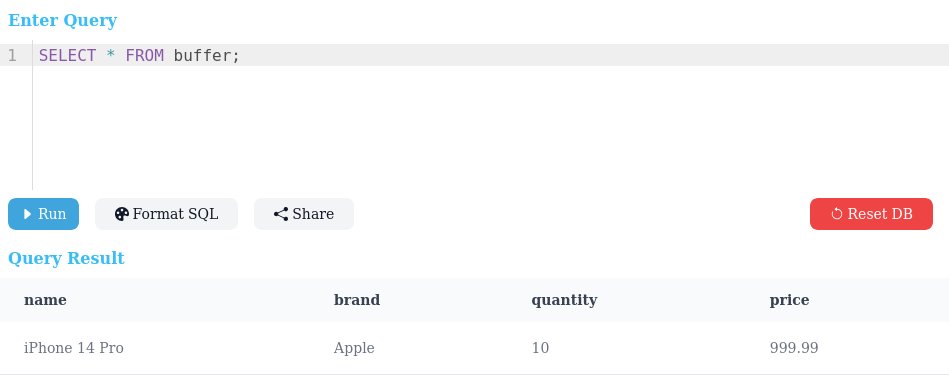

##### Multiple:
```sql
~
INSERT INTO buffer (name, brand, quantity, price)
VALUES 
    ('iPhone 15 Pro', 'Apple', 11, 1000.99),
    ('iPhone 16 Pro', 'Apple', 12, 1001.99),
    ('iPhone 17 Pro', 'Apple', 13, 1002.99),
    ('iPhone 18 Pro', 'Apple', 14, 1003.99);
```

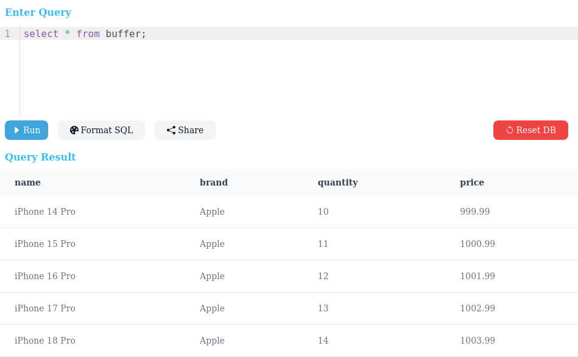

##### Insert With Return:
```sql
~

INSERT INTO buffer (name, brand, quantity, price)
VALUES ('iPhone 69 Pro', 'Apple', 420, 69.99) 
RETURNING *;
```

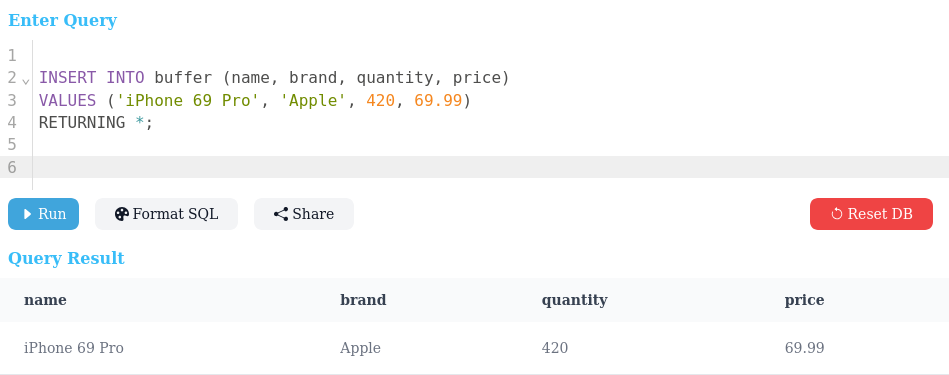

---

# SELECTS:

#### Select Individual,Multiple columns
>[!TIP]
> For multiple, use comma seperated column names; or just use the wildcard `*` to grab everything.
```sql
~
SELECT name from buffer;
```
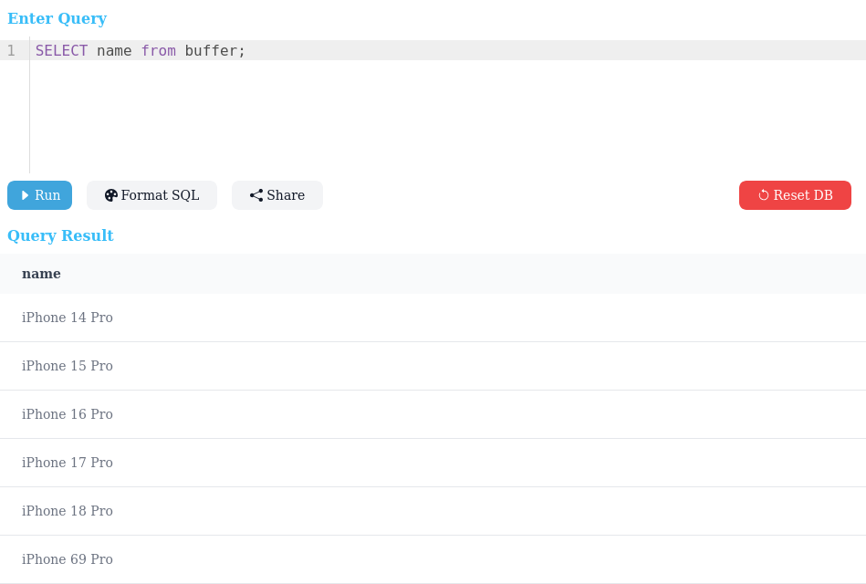


#### Using SELECT to transform data
```sql
~

SELECT name, quantity * price from buffer;
```
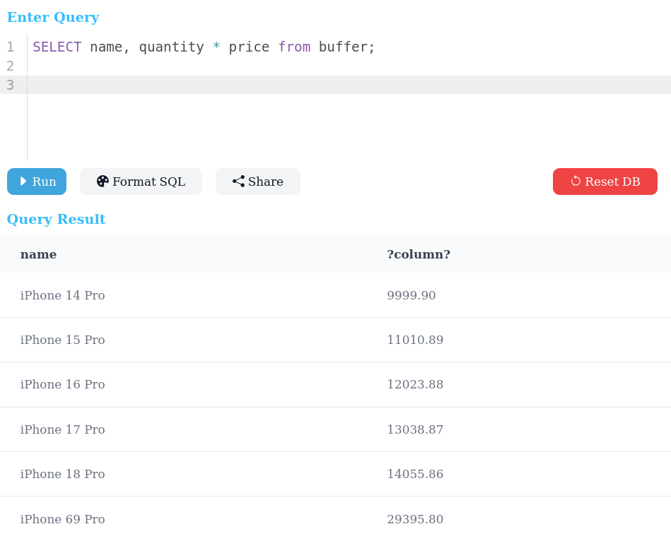

>[!NOTE]
> The transformed column comes out as `?column?`; to give an alias to it use the `AS` keyword:
> ```sql
> ~
> 
> SELECT name, quantity * price AS TRANSFORMDE from buffer;
> 
> ```
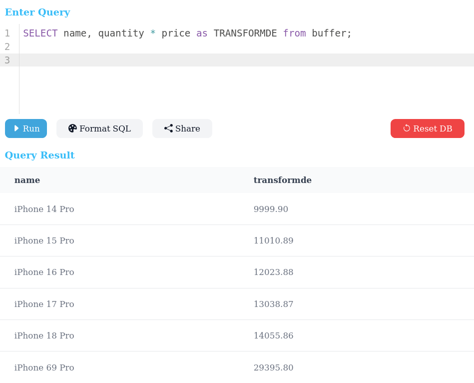

>[!TIP] or better yet, you can drop the `AS` keyword entirely:
> ```sql
> ~
> SELECT name, quantity * price TRANSFORMDE from buffer;
> ```


---


# Concatenating Strings

#### concatenate operator
>[!TIP]
> To concatenate strings, u use `||`

```sql
~

SELECT name || brand AS title , quantity * price AS TRANSFORMDE from buffer;

```
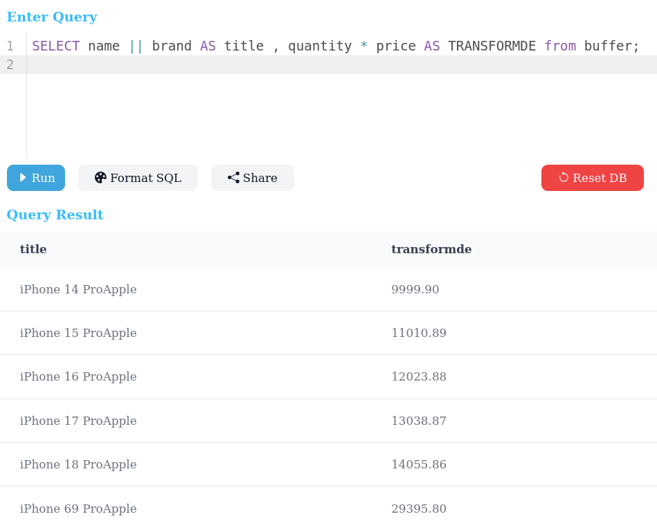

#### concatenate function

```sql
~
SELECT CONCAT(name, ' === ' , brand ) AS title , quantity * price AS stuff from buffer;
```

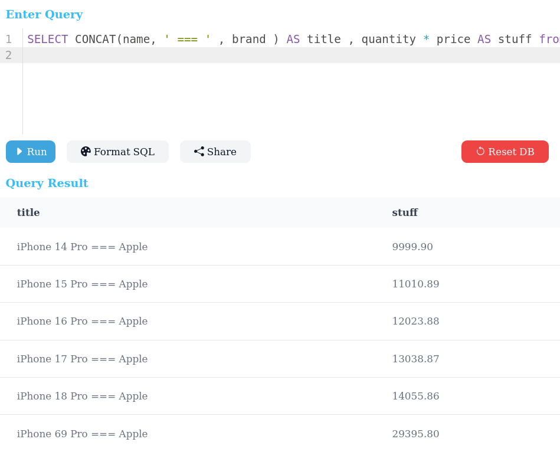

>[!TIP]
> Although, this works, a more "for the job" function for adding in a seperator is:
```sql
~
SELECT CONCAT_WS( ' === ', name, brand ) AS title , quantity * price AS stuff from buffer;
```


---

# Dropping A Table:
```sql
~
DROP TABLE [IF EXISTS] buffer;
```
>[!NOTE]
> The drop keyword can take multiple table names like so:
> ```sql
> ~
> DROP TABLE [IF EXISTS] buffer,some_other_table,...;
> ```

---

# Where Clause:

#### `>` operator:
```sql
~
SELECT * FROM buffer WHERE quantity > 9;
```

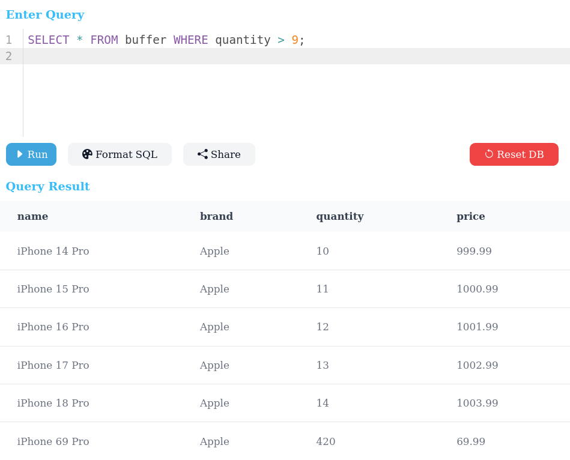

>[!TIP]
> Same stuff for `<` `!=` `=` and other normal operators


#### WHERE clause and alias:

```sql
~
SELECT name, quantity * price AS stuff FROM buffer WHERE quantity * price > 10000;
```

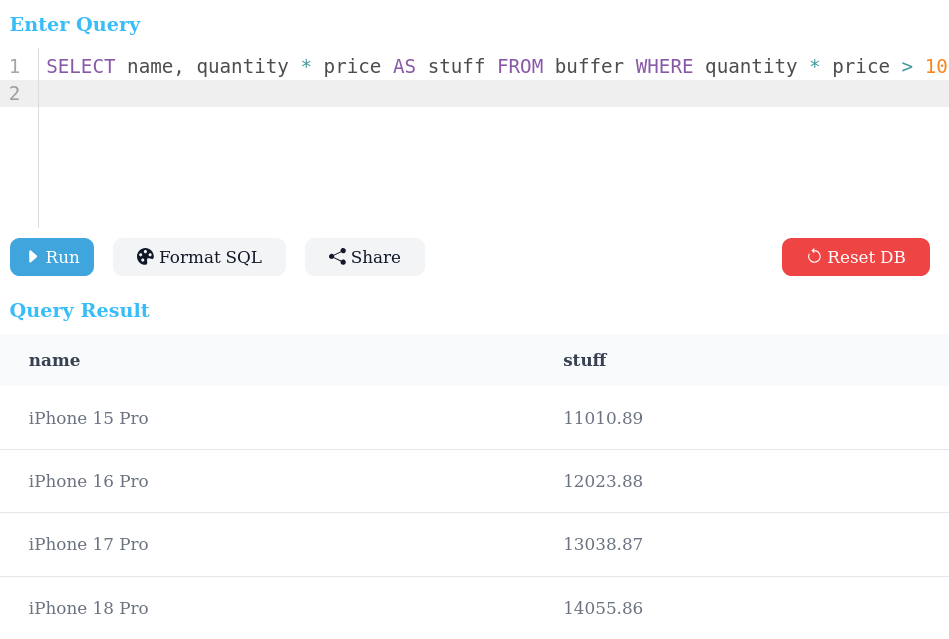

---

# BETWEEN operator

>[!NOTE]
> Basically just a shorthand for `value >= low AND value <= high`

```sql
~

SELECT name, quantity * price AS stuff FROM buffer WHERE price BETWEEN 1000 AND 1003;
```

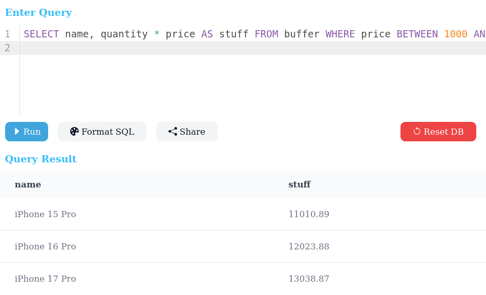

# NOT BETWEEN Operator
just the negation of the BETWEEN operator

```sql
~

SELECT name, quantity * price AS stuff FROM buffer WHERE price NOT BETWEEN 1000 AND 1003;
```

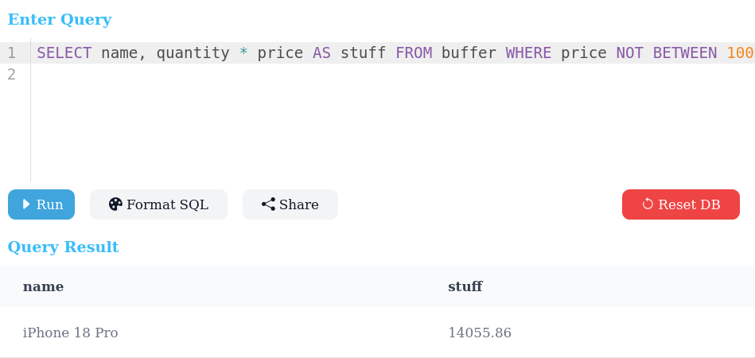

---

# IN operator

```sql
~

SELECT name, quantity * price AS stuff FROM buffer WHERE quantity IN(11, 14);

```

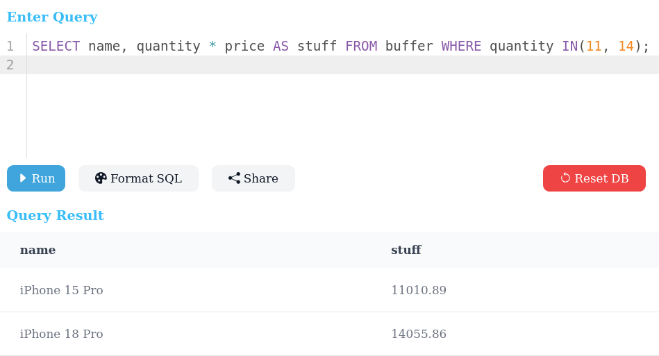

# NOT IN Operator
similar to the between stuff:

```sql
~

SELECT name, quantity * price AS stuff FROM buffer WHERE quantity NOT IN(11, 14);

```

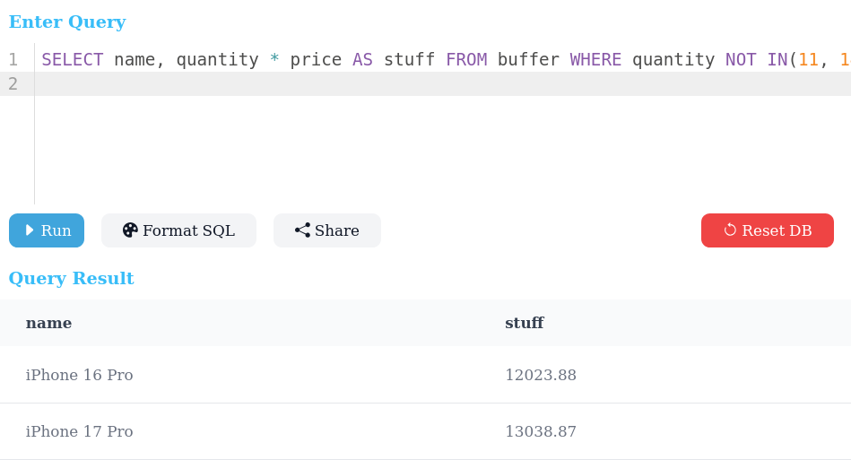

---

# UPDATE operator:

#### Update single:

```sql
~

UPDATE buffer
SET name = 'SOMETHING ELSE' WHERE name = 'iPhone 16 Pro';

```

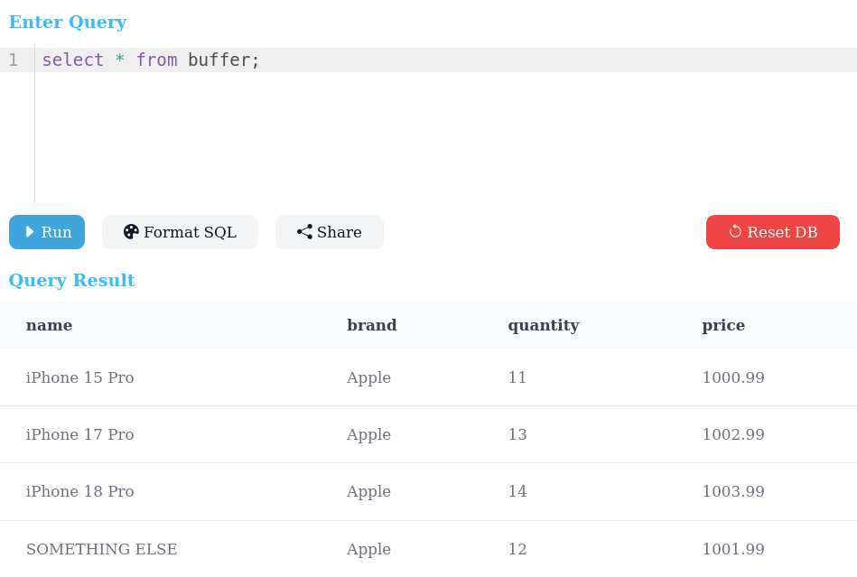


#### Update All:

```sql
~

UPDATE buffer
SET quantity = quantity + 1 ;

```


#### With Return:

```sql
~

UPDATE buffer
SET quantity = quantity + 1 
RETURNING name, quantity ;

```

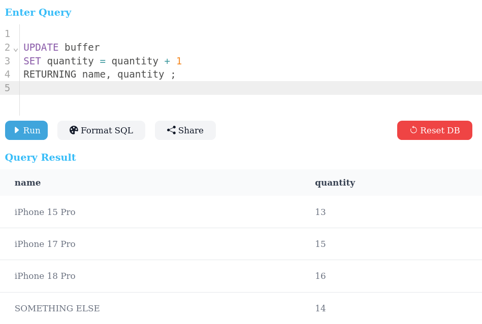

---

# DELETE Statement

#### Delete All
```sql
~
DELETE from buffer

```

#### Delete + where
```sql
~

DELETE from buffer
WHERE quantity <= 13;
```
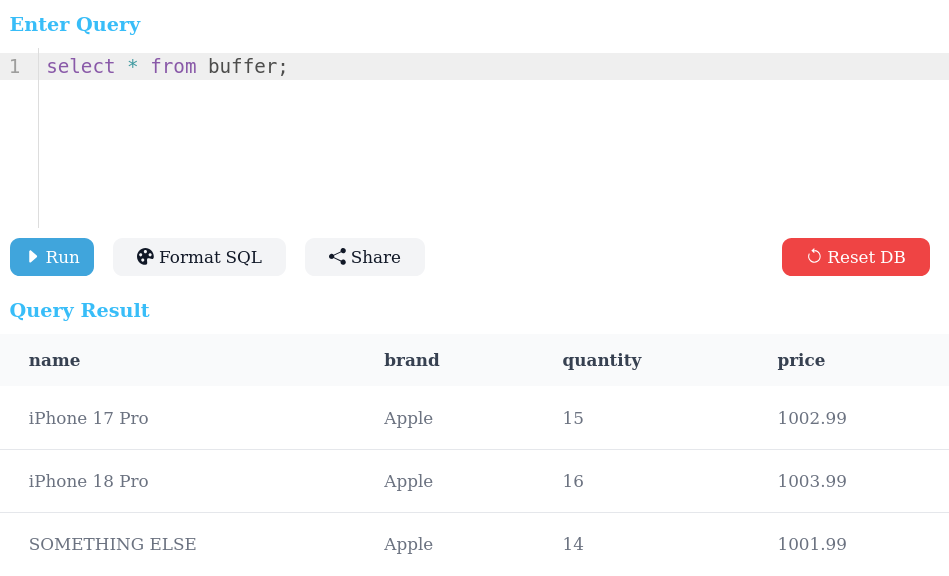

#### Delete + where + return

```sql
~

DELETE from buffer
WHERE quantity <= 14
RETURNING name;
```

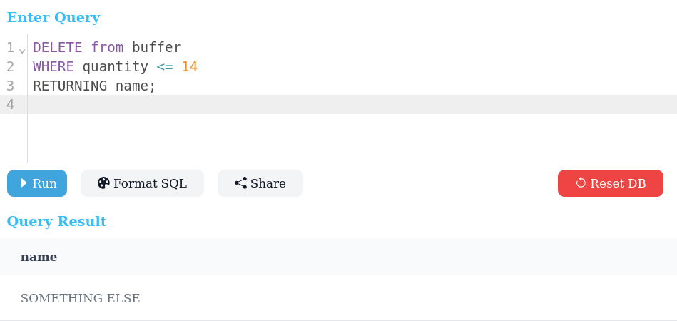

---

# DB Design:

#### Primary Key:
```sql
~

create table custom(
  ca int,
  cb varchar(20),
  cc int,

  primary key (ca)
);
```

#### Auto Incrementing Primary Key:
```sql
~
ALTER table custom
ALTER COLUMN ca ADD GENERATED ALWAYS AS IDENTITY;

```

--- 

## NULL:

>[!NOTE]
> COmparing null with any other atribute results in `null`
> ```sql
> ~
> SELECT
>  NULL = 1 AS result;
> ```
> Result: `NULL`

#### NULL + INSERT

```sql
~
INSERT INTO custom (cb, cc)
VALUES('Something', NULL)
RETURNING *;
```

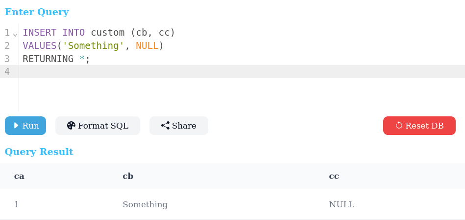

---
# Moving on to the actual workshop:

## Init:
```sql
~
create table workshop (
ca int,
cb varchar(20),
cc int
);

INSERT INTO workshop (ca, cb, cc) VALUES
(1, 'Hammer', 10),
(2, 'Screwdriver', 25),
(3, 'Wrench', 15),
(4, 'Drill', 5),
(5, 'Pliers', 20);


=====

create table workshop_dup (
ca int,
cb varchar(20),
cc int
);

INSERT INTO workshop (ca, cb, cc) VALUES
(1, 'Hammer', 10),
(2, 'Screwdriver', 25),
(3, 'Wrench', 15),
(4, 'Drill', 5),
(5, 'Pliers', 20);

the second table just for joins and stuff
```


### Foundational SQL and Querying:

- Understand the structure of relational databases.
- Queries using:
- `SELECT`
```sql
~
select * from workshop; 
```
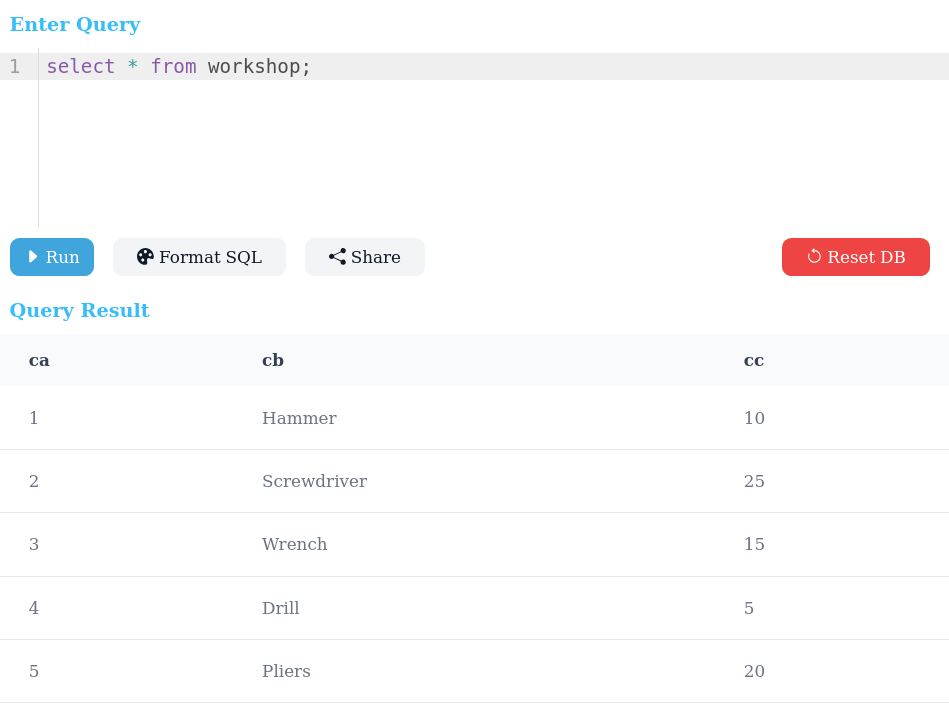

- `WHERE`
```sql
~
select * from workshop
where cc > 10; 
```

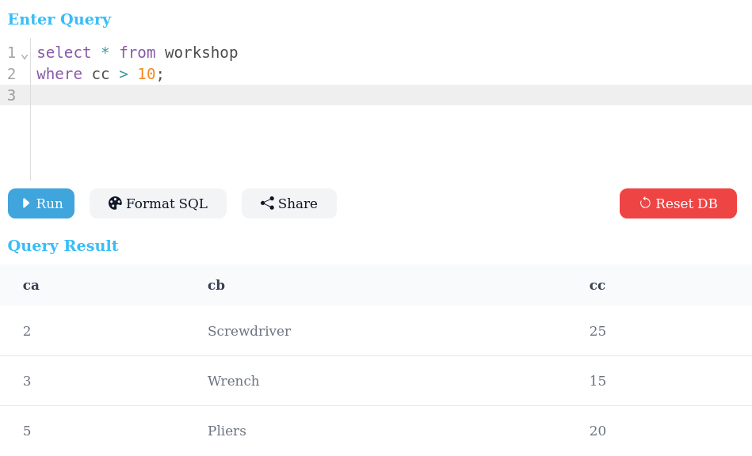
- `JOIN`
```sql
~

SELECT w.cb AS item1, wd.cb AS item2
FROM workshop w
JOIN workshop_dup wd ON w.ca = wd.ca;

```
- `GROUP BY`
```sql
~

SELECT cb, SUM(cc) AS total_quantity
FROM workshop
GROUP BY cb;

```

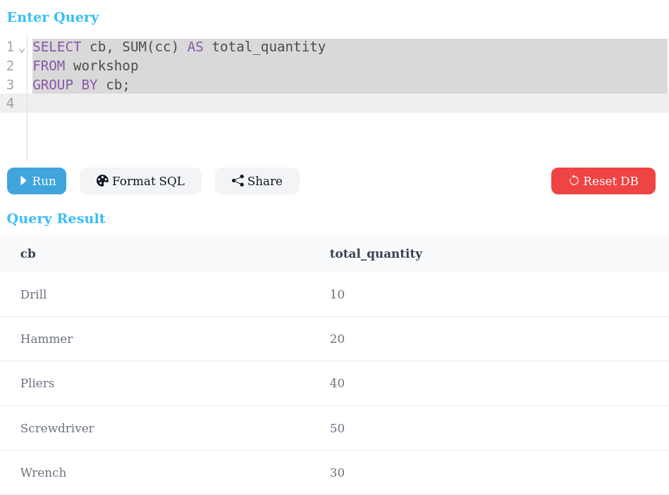
- `HAVING`
```sql
~

SELECT cb, SUM(cc) AS total_quantity
FROM workshop
GROUP BY cb
HAVING SUM(cc) > 20;

```
- Apply set operators like `UNION`, `INTERSECT` and `EXCEPT` to combine query results.
```sql
~

SELECT cb FROM workshop
UNION
SELECT cb FROM workshop_dup;
```
```sql
~

SELECT cb FROM workshop
INTERSECT
SELECT cb FROM workshop_dup;
```
```sql
~

SELECT cb FROM workshop
EXCEPT
SELECT cb FROM workshop_dup;

```


### Working With Data Tables:

- Create, Modify and delete tables using `create`, `alter`, `delete`:
- Define constraints `PRIMARY KEY`, `FOREIGN KEY`, `UNIQUE`, `CHECK`, `NOT NULL`

```sql
~
CREATE TABLE employees (
  id INT PRIMARY KEY,
  name VARCHAR(50) NOT NULL,
  email VARCHAR(100) UNIQUE,
  age INT CHECK (age >= 18),
  department_id INT,
  CONSTRAINT fk_department FOREIGN KEY (department_id) REFERENCES departments(id)
);
```
```sql
~

ALTER TABLE employees
ADD COLUMN salary DECIMAL(10,2) NOT NULL DEFAULT 0;
```
```sql
~

ALTER TABLE employees
DROP COLUMN salary;
```
```sql
~


ALTER TABLE employees
ADD CONSTRAINT unique_email UNIQUE(email);
```
```sql
~

ALTER TABLE employees
DROP CONSTRAINT unique_email;
```
```sql
~

DROP TABLE employees;
```


### Datatypes and functions 
- Understand and apply data types including numbers, text, bool, date/time, UUID
- USE built-in functions: `string`, `date`, `math`, `aggregate`
- Master type casting and expression evaluation: `CAST`, `coalesce`, `case`, `nullif`
```sql
~

SELECT UPPER(cb), LENGTH(cb), SUBSTRING(cb, 1, 3) FROM workshop;
```
```sql
~

SELECT CURRENT_DATE, CURRENT_TIMESTAMP;
SELECT EXTRACT(YEAR FROM CURRENT_DATE);
```
```sql
~

SELECT ABS(-5), ROUND(3.14159, 2), FLOOR(2.9), CEIL(2.1);
```
```sql
~

SELECT COUNT(*), SUM(cc), AVG(cc), MAX(cc), MIN(cc) FROM workshop;
```

```sql
~

SELECT CAST(cc AS VARCHAR) FROM workshop;
```
```sql
~

SELECT COALESCE(NULL, NULL, 'default value');
```
```sql
~

SELECT cb,
  CASE 
    WHEN cc > 20 THEN 'High'
    WHEN cc BETWEEN 10 AND 20 THEN 'Medium'
    ELSE 'Low'
  END AS quantity_level
FROM workshop;
```
```sql
~
SELECT NULLIF(cc, 10) FROM workshop;
```


### Database and performance optimization
- create and manage indexes to optimize query performance,
- apply normalization and denormalization
- evalute query plans using `explain`
- use views and materialized views to abstract and accelerate query logic
```sql
~

CREATE INDEX idx_cb ON workshop(cb);
```
```sql
~

DROP INDEX idx_cb;
```
```sql
~

EXPLAIN SELECT * FROM workshop WHERE cb = 'Hammer';

```
```sql
~

CREATE VIEW high_quantity_tools AS
SELECT cb, cc FROM workshop WHERE cc > 20;
```
```sql
~

CREATE MATERIALIZED VIEW mat_high_quantity_tools AS
SELECT cb, cc FROM workshop WHERE cc > 20;

REFRESH MATERIALIZED VIEW mat_high_quantity_tools;
```


### Procedural programming 
- Manipulate variable control structures: `IF`, `case`, `loop`, `while`, `for`
- develop and invoke stored procedures and functions for modular logic
- handle exceptions using `exception` and `raise`
```sql
~

DO $$
BEGIN
  IF (SELECT COUNT(*) FROM workshop) > 5 THEN
    RAISE NOTICE 'More than 5 rows';
  ELSE
    RAISE NOTICE '5 or less rows';
  END IF;
END $$;
```
```sql
~

SELECT cb,
  CASE 
    WHEN cc > 20 THEN 'High'
    WHEN cc > 10 THEN 'Medium'
    ELSE 'Low'
  END AS quantity_level
FROM workshop;
```
```sql
~

DO $$
DECLARE
  counter INT := 1;
BEGIN
  WHILE counter <= 5 LOOP
    RAISE NOTICE 'Count: %', counter;
    counter := counter + 1;
  END LOOP;
END $$;

```
```sql
~

DO $$
BEGIN
  FOR i IN 1..5 LOOP
    RAISE NOTICE 'Iteration %', i;
  END LOOP;
END $$;
```
```sql
~

CREATE OR REPLACE FUNCTION get_tool_quantity(tool_name VARCHAR)
RETURNS INT AS $$
DECLARE
  total INT;
BEGIN
  SELECT SUM(cc) INTO total FROM workshop WHERE cb = tool_name;
  RETURN COALESCE(total, 0);
END;
$$ LANGUAGE plpgsql;

SELECT get_tool_quantity('Hammer');
```

```sql
~

CREATE OR REPLACE PROCEDURE increase_quantity(tool_name VARCHAR, amount INT)
LANGUAGE plpgsql AS $$
BEGIN
  UPDATE workshop SET cc = cc + amount WHERE cb = tool_name;
END;
$$;

CALL increase_quantity('Hammer', 5);
```
```sql
~

DO $$
BEGIN
  -- Trying to update a tool that might not exist
  UPDATE workshop SET cc = cc + 10 WHERE cb = 'NonExistentTool';

  IF NOT FOUND THEN
    RAISE EXCEPTION 'Tool not found!';
  END IF;
EXCEPTION
  WHEN OTHERS THEN
    RAISE NOTICE 'Caught an error: %', SQLERRM;
END $$;
```


### Triggers and event handling
- design triggers and automate reactions to table-level changes (`insert`, `update`, `delete`)
```sql
~

CREATE TABLE workshop_log (
  id SERIAL PRIMARY KEY,
  action VARCHAR(10),
  tool_name VARCHAR(20),
  action_time TIMESTAMP DEFAULT CURRENT_TIMESTAMP
);
```
```sql
~

CREATE OR REPLACE FUNCTION log_workshop_insert()
RETURNS TRIGGER AS $$
BEGIN
  INSERT INTO workshop_log (action, tool_name)
  VALUES ('INSERT', NEW.cb);
  RETURN NEW;
END;
$$ LANGUAGE plpgsql;
```
```sql
~

CREATE TRIGGER trg_workshop_insert
AFTER INSERT ON workshop
FOR EACH ROW
EXECUTE FUNCTION log_workshop_insert();

```

### Advanced transaction management
- understand transaction control using `begin`,` commit`, `rollback`
```sql
~

BEGIN;
UPDATE workshop SET cc = cc - 5 WHERE cb = 'Hammer';
COMMIT;  

```
```sql
~

BEGIN;

UPDATE workshop SET cc = cc - 5 WHERE cb = 'Hammer';

IF (SELECT cc FROM workshop WHERE cb = 'Hammer') < 0 THEN
  ROLLBACK; 
ELSE
  COMMIT;
END IF;
```
```sql
~


BEGIN;

UPDATE workshop SET cc = cc - 5 WHERE cb = 'Hammer';

SAVEPOINT sp1;

UPDATE workshop SET cc = cc - 2 WHERE cb = 'Drill';

ROLLBACK TO sp1;  -- Undo last update but keep previous changes

COMMIT;
```
### Postgresql admin
- Manage user, roles and priveleges securely using `grant` and `revoke`

```sql
~

CREATE USER alice WITH PASSWORD 'supersecret';
// Allow full crud
GRANT SELECT, INSERT, UPDATE, DELETE ON workshop TO developer;

// Revoke all
REVOKE ALL ON workshop FROM alice;
```
