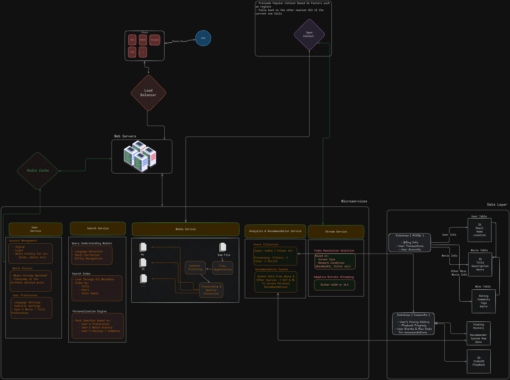

# Workshop 1: Apply System Design Framework to Netflix || ~~Facebook~~
---

### ++Step 1. Understand the problem and establish design scope:++

**Functional Requirements:**
- Support For Play / Pause, Fast Forward, Rewind
- Creation / Login User Profiles, Curated Recommendations, Search
- Account State Management
- Subscription Management

**Non-Functional Requirements**
- Low Latency
- High Availability
- Fault Tolerance
- Cost Efficiency
- Scalability {}

**Workloads & Constraints**:
- Mainly read-heavy
- Large Media Files
- Heavy Network Bandwidth Consumption
- Global Distribution Needed

**assumptions**:
>[!TIP]
> ##### Average Movie Size:
> - Average Movie Length[^2]: $\approx 131\text{minutes}$
> - Uses Adaptive Bitrate Streaming via DASH[^3], so no clear way to determine, but, they[^4] state the following: 
     - (The following are adjusted estimates because of the shorter average runtime)
>    - Standard Definition (SD): Approximately 1.2 GB.
>    - High Definition (HD): Approximately 3.5 GB.
>    - Ultra High Definition (4K): Approximately 7 GB.
> ##### Estimate % based on quality
> - All titles are probably in SD (100%)
> - HD for say 80%
> - 4K for say 30% 
> ##### Weighted Average:
> - (1.0 * 1.2GB) + (0.8 * 3.5GB) + (0.3 * 7GB)  = ~ 6GB approx
> ##### Number Of Titles:
> - Total Titles: Depends on the region, US had $\approx$ 6,621 movies[^5]; AUS had $\approx$ 4,462 movies[^6], so globally $\approx$ 7000 titles total. 
>
> ==Final Verdict==
> Therefore Sum Total: $\approx 6\text{GB} \times 7000\text{titles} = \approx 42\text{TB}$

- DAU[^1]: $\approx 302\text{M} \times 0{.}5 \approx 151\text{M}$
- Each user watches $\approx 5$ titles per day, that's $\approx 775$ Million titles Watched Per Day.
- Assuming a 200:1 read to write ration, that's $\approx 3.875$ Million titles written per day.
    - thats, $3.875M \times 6\text{GB} \approx 23\text{TB}$
- [Total File Size](#rough-estimation): $\approx 98\text{TB}$ 

---

### ++Step 2. Propose a High-Level Design and Get Buy-In:++

[^1]: https://evoca.tv/netflix-user-statistics/#:~:text=How%20Many%20Subscribers%20Does%20Netflix,subscribers%20in%20the%20last%20year.&text=The%20United%20States%20And%20Canada,Region%20as%20of%20Q3%202024.
[^2]: https://thedailyaztec.com/117837/opinion/despite-growing-criticism-the-length-of-movies-arent-getting-too-long/
[^3]: https://www.quora.com/Does-Netflix-use-Dash
[^4]: https://www.quora.com/What-is-the-average-size-of-a-3-hour-movie-file-on-Netflix
[^5]: https://www.whats-on-netflix.com/news/netflix-originals-now-make-up-55-of-us-library/
[^6]: https://www.tomsguide.com/reference/netflix-price-australia
