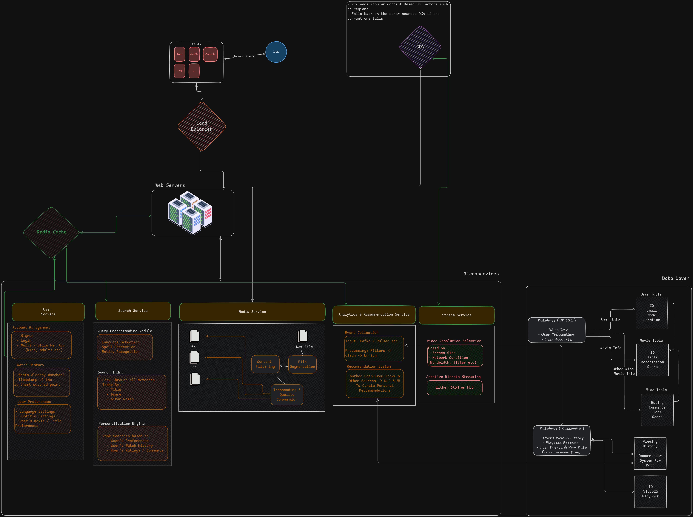

# Workshop 1: Apply System Design Framework to Netflix || ~~Facebook~~
---

### ++Step 1. Understand the problem and establish design scope:++

**Functional Requirements:**
- Support For Play / Pause, Fast Forward, Rewind
- Creation / Login User Profiles, Curated Recommendations, Search
- Account State Management
- ==Subscription Management==

**Non-Functional Requirements**
- Low Latency
- High Availability
- Fault Tolerance
- Cost Efficiency
- Scalability {}

**Workloads & Constraints**:
- Mainly read-heavy
- Large Media Files
- Heavy Network Bandwidth Consumption
- Global Distribution Needed

### ++Assumptions & Estimations:++
>[!TIP]
> # High Level Assumptions
> ##### Average Movie Size:
> - Average Movie Length[^2]: $\approx 131\text{minutes}$
> - Uses Adaptive Bitrate Streaming via DASH[^3], so no clear way to determine, but, they[^4] state the following: 
     - (The following are adjusted estimates because of the shorter average runtime)
>    - Standard Definition (SD): Approximately 1.2 GB.
>    - High Definition (HD): Approximately 3.5 GB.
>    - Ultra High Definition (4K): Approximately 7 GB.
> ##### Estimate % based on quality
> - All titles are probably in SD (100%)
> - HD for say 80%
> - 4K for say 30% 
> ##### Weighted Average:
> - (1.0 * 1.2GB) + (0.8 * 3.5GB) + (0.3 * 7GB)  = ~ 6GB approx
> ##### Number Of Titles:
> - Total Titles: Depends on the region, US had $\approx$ 6,621 movies[^5]; AUS had $\approx$ 4,462 movies[^6], so globally $\approx$ 7000 titles total. 
>
> Therefore Sum Total: $\approx 6\text{GB} \times 7000\text{titles} = \approx 42\text{TB}$

- DAU[^1]: $\approx 302\text{M} \times 0{.}5 \approx 151\text{M}$
- Each user watches $\approx 5$ titles per day, that's $\approx 775$ Million titles Watched Per Day.
- Assuming a 200:1 read to write ration, that's $\approx 3.875$ Million titles written per day.
    - thats, $3.875M \times 6\text{GB} \approx 23\text{TB}$
- Total File Size: $\approx 98\text{TB}$ 

>[!TIP]
># QPS Estimation
>##### Read QPS:
> - Reads Per Day = $3.875M \times 200 = 775M$
> - Per Second = $\frac{775M}{24 \times 60 \times 60} \approx 9000rps$
> ##### Write QPS:
> - Writes Per Second = $\frac{3.875M}{86400} \approx 45wps$

>[!NOTE]
># QPS SUMMARY
> - Reads: ~9k/s
> - Writes: ~45/s
> - Peak Traffic: 
>   - Reads: 18k/s
>   - Writes: 90/s

---

### ++Step 2. Propose a High-Level Design and Get Buy-In:++

### ++Step 3: Dive into the details++

#### Identify Bottlenecks & Mitigation:

| **Component**         | **Potential Bottleneck**                       | **Mitigation Strategy**                                                         |
| --------------------- | ---------------------------------------------- | ------------------------------------------------------------------------------- |
| CDN                   | Sudden traffic spikes during premieres         | Use regional CDNs, cache popular content aggressively                           |
| Auth Service          | Mass Login(e.g., new movie drop)               | Introduce rate limiting, cache auth tokens, async session validation            |
| Recommendation Engine | Heavy ML model computation                     | Use pre-computed recommendations with nightly batch jobs, cache results         |
| Video Transcoding     | CPU-intensive and slow                         | Do it asynchronously, use specialized GPU clusters, queue using priority system |

#### Replication & Scaling Plan

| **Layer**              | **Strategy**                                                                             |
| ---------------------- | ---------------------------------------------------------------------------------------- |
| **Video Storage**      | Globally replicated via object stores                         |
| **Databases**          | Partition by region + entity (user_id, movie_id); strong consistency only where needed   |
| **User Profiles**      | Eventually consistent replicas, cache-first design                                       |
| **Recommendations**    | Pre-generated|

#### Resilience Methods

| **Component**       | **Resilience Strategy**                                                         |
| ------------------- | ------------------------------------------------------------------------------- |
| All Services        | Circuit Breakers |
| Microservices Comm. | Timeout fallback responses, dead-letter queues for failed jobs,latency monkey                  |
| Data Loss           | Daily backups, versioned storage buckets                                        |
| Chaos Monkey        | Randomly kills instances to test auto-healing; Netflix uses it in prod          |
| UI                  | Graceful fallback ("Try Again", offline support, loading states, degraded mode) |

#### Tradeoff Vitals

| **Trade-off**                     | **Netflix Approach**                                                           |
| --------------------------------- | ------------------------------------------------------------------------------ |
| **Latency vs Cost**               | Pay premium for low-latency CDNs, cache content close to users                 |
| **Consistency vs Availability**   | Prioritize availability, use eventual consistency for user-generated data      |
| **Durability vs Speed**           | Use write-ahead logs + background replication to balance                       |
| **Batch vs Real-time Processing** | Batch for ML workloads, real-time for metrics and playback data |

### Step 4: Wrap Up with Bottlenecks, Improvements, and Scaling Paths

**Fallback & Recovery**:
- Auth Faliure -> Serve Cached Session Tokens 
- Recommendation Engine Faliure -> Default Popular Titles or user's past favourites
- Search Timeout -> Show default category 

---

# Comparison: This vs Real-World Netflix System
This architecture aims to capture a solid high-level overview of how a streaming service like Netflix could function. It includes key components such as client devices (TV, web, mobile), DNS resolution, media services (filtering, segmentation, transcoding), and a search system with language detection and metadata indexing. 

However, in reality, Netflix’s architecture is far more complex and optimized for massive scale. Some of the more obvious differences include:
- DNS Resolution: While DNS resolution does happen, Netflix uses AWS Route53 along with their proprietary global traffic controller to route users to the closest Open Connect CDN edge server, not just a simple domain resolution.
- Media Service: The media pipeline involves studio-level ingestion, automated quality checks, and multiple encoding passes tailored for device and network conditions—handled by their internal tools like Cosmos and Titus.
- Search & Recommendation: For search and recommendations, Netflix goes beyond metadata indexing. Their system uses a knowledge graph, deep learning-based query understanding, and reinforcement learning models to personalize rankings in real time. Playback is handled via adaptive bitrate streaming (DASH), with manifests generated dynamically per device.
- Faliure & Recovery: The real Netflix architecture emphasizes resilience through heavy chaos engineering. They use tools like Chaos Monkey, Janitor Monkey, Latency Monkey etc. They have multi-level fallback strategies and have predictive scaling.
- Data Storage: Netflix uses a mix of Cassandra, DynamoDB, EVCache , and multi-layered object storage (S3) with tunable consistency per data type. They replicate data globally with region-aware routing and carefully balance consistency and availability depending on the service needs.
- Tradeoffs: Cost vs Latency is heavily optimized in the real Netflix, they own their own CDNs to cut costs, while keeping the latency low. Recommendations are updated near real-time using multiple ML models running simultaniously 

While a high-level architecture can capture the essential components of a streaming platform—such as media processing, user authentication, content delivery, and recommendation systems—the real-world implementation at Netflix demonstrates the immense complexity required to operate at global scale. Netflix's system is deeply optimized for reliability, performance, and cost-efficiency through advanced tools, automated pipelines, and intelligent traffic management. Their use of chaos engineering, real-time personalization, and globally distributed infrastructure illustrates how engineering is critical to delivering seamless streaming experiences to hundreds of millions of users worldwide.

**Scaling Path: 1M -> 100M**

| **Phase**   | **Action**                                                                          |
| ----------- | ----------------------------------------------------------------------------------- |
| 1M → 10M    | Horizontal scaling, CDN expansion, DB sharding by region/entity                     |
| 10M → 100M  | Multi-region data centers, async pipelines for all writes, stronger cache hierarchy |

[^1]: https://evoca.tv/netflix-user-statistics/#:~:text=How%20Many%20Subscribers%20Does%20Netflix,subscribers%20in%20the%20last%20year.&text=The%20United%20States%20And%20Canada,Region%20as%20of%20Q3%202024.
[^2]: https://thedailyaztec.com/117837/opinion/despite-growing-criticism-the-length-of-movies-arent-getting-too-long/
[^3]: https://www.quora.com/Does-Netflix-use-Dash
[^4]: https://www.quora.com/What-is-the-average-size-of-a-3-hour-movie-file-on-Netflix
[^5]: https://www.whats-on-netflix.com/news/netflix-originals-now-make-up-55-of-us-library/
[^6]: https://www.tomsguide.com/reference/netflix-price-australia
