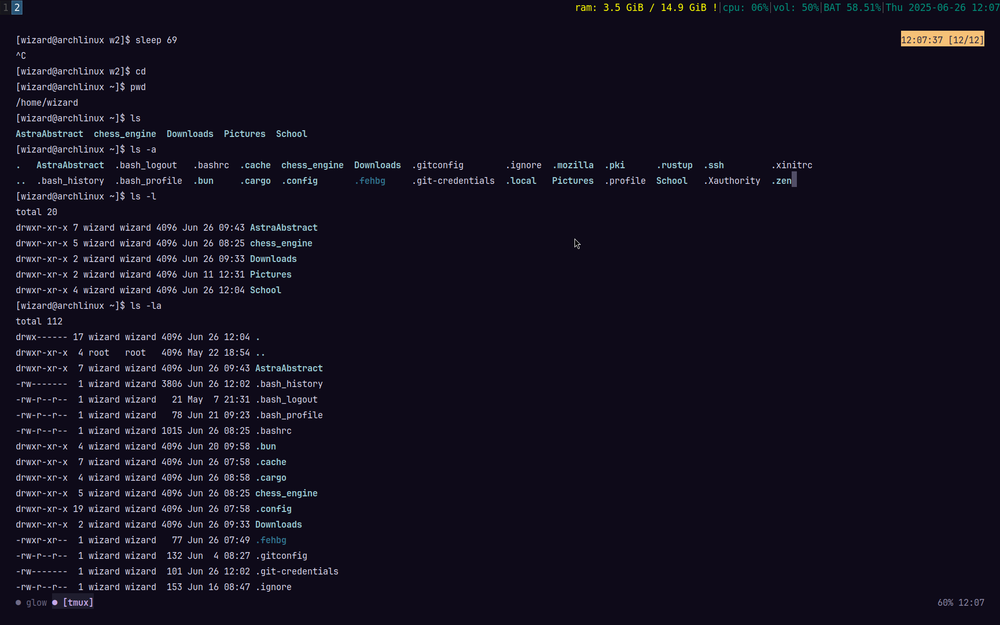
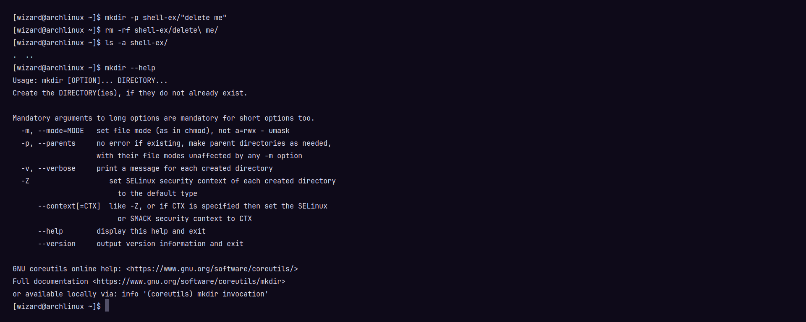
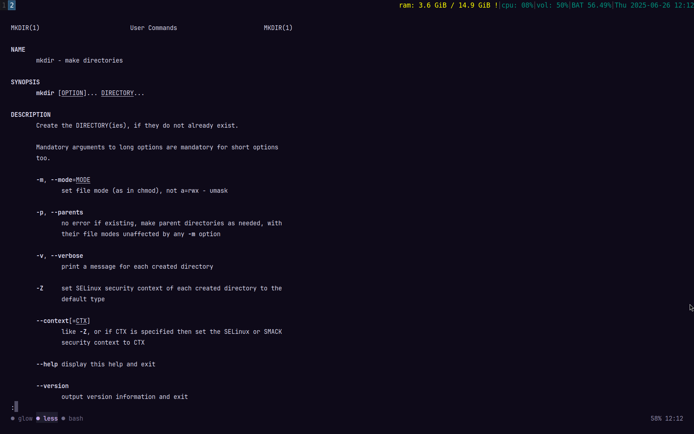
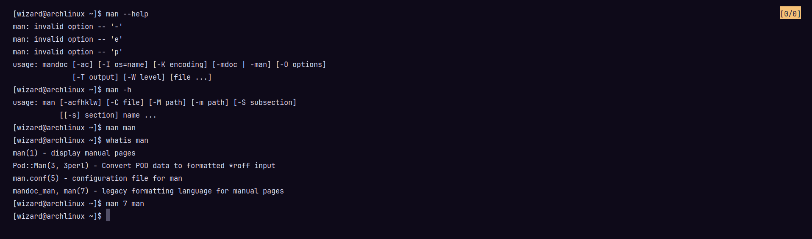
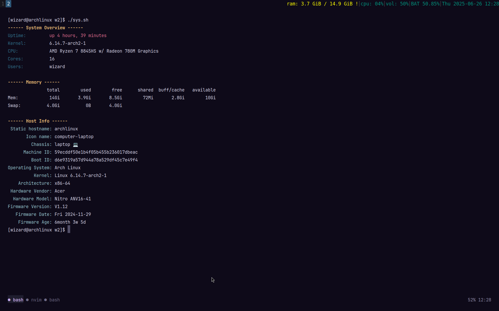

# Week-2; Workshop: Linux 

### Task 1:






---

==something==

### Task 2: Bash Script

```bash
~
#! /usr/bin/bash
echo "Hello World"
```

```bash
~

[wizard@archlinux w2]$ chmod +x first.sh && ./first.sh
Hello World
[wizard@archlinux w2]$
```
---

### Task 3: System Script

```bash
#!/bin/bash

RED='\033[0;31m'
GRN='\033[0;32m'
YLW='\033[1;33m'
CYN='\033[0;36m'
NC='\033[0m'

function sysinfo() {
    echo -e "${YLW}------ System Overview ------${NC}"
    echo -e "${GRN}Uptime:${NC}         ${RED}$(uptime -p)${NC}"
    echo -e "${GRN}Kernel:${NC}         $(uname -r)"
    echo -e "${GRN}CPU:${NC}            $(lscpu | grep 'Model name' | awk -F: '{print $2}' | sed 's/^ *//')"
    echo -e "${GRN}Cores:${NC}          $(lscpu | grep '^CPU(s):' | awk -F: '{print $2}' | sed 's/^ *//')"
    echo -e "${GRN}Users:${NC}          $(w -h | cut -d ' ' -f1 | sort | uniq | paste -sd ', ')"


    echo -e "\n${YLW}------ Memory ------${NC}"
    free -h

    echo -e "\n${YLW}------ Host Info ------${NC}"
    hostnamectl
}

sysinfo
```


