# Week 3:
- Linux server configuration
- Web server deployment
- SSL/TLS fundamentals
- Network traffic analysis with Wireshark


### Question 1: Install and Configure Nginx with a Self-Signed Certificate

##### 1. Installing `nginx`
```bash
~
[wizard@archlinux w3]$ sudo pacman -S nginx
warning: nginx-1.28.0-3 is up to date -- reinstalling
resolving dependencies...
looking for conflicting packages...

Packages (1) nginx-1.28.0-3

Total Installed Size:  1.56 MiB
Net Upgrade Size:      0.00 MiB

:: Proceed with installation? [Y/n] n
[wizard@archlinux w3]$
```

##### 2. Generating Self Signed Certificate With `openssl`
```bash

[wizard@archlinux w3]$ openssl req -x509 -nodes -days 365 -newkey rsa:2048   -keyout selfsigned.key -out selfsigned.crt   -subj "/C=NP/ST=SomeState/L=SomeCity/O=SomeOrg/CN=localhost"
```

##### 3. Moving the key and certificate inside `/etc/nginx/`
```bash
~
[wizard@archlinux w3]$ sudo mkdir /etc/nginx/ssl/ 
--- Entered Password ---
[wizard@archlinux w3]$ sudo mv selfsigned* /etc/nginx/ssl/
--- Entered Password ---
```
##### 4. Updated the default `nginx.conf` to:
```nginx
~
worker_processes  1;

include modules.d/*.conf;

events {
    worker_connections  1024;
}

http {
    include       mime.types;
    default_type  application/octet-stream;

    sendfile        on;
    keepalive_timeout  65;

    server {
        listen       80;
        server_name  localhost;

        location / {
            root   /usr/share/nginx/html;
            index  index.html index.htm;
        }

        error_page   500 502 503 504  /50x.html;
        location = /50x.html {
            root   /usr/share/nginx/html;
        }
    }

    server {
        listen       443 ssl;
        server_name  localhost;

        ssl_certificate      ssl/selfsigned.crt;
        ssl_certificate_key  ssl/selfsigned.key;

        ssl_session_cache    shared:SSL:1m;
        ssl_session_timeout  5m;

        ssl_ciphers  HIGH:!aNULL:!MD5;
        ssl_prefer_server_ciphers  on;

        location / {
            root   /usr/share/nginx/html;
            index  index.html index.htm;
        }
    }
}
```
##### 5. Updated the default html page that lives in `/usr/share/nginx/html/` to:
```html
~

<!DOCTYPE html>
<html>
  <head>
    <title>Welcome to nginx!</title>
    <link href="https://fonts.googleapis.com/css2?family=Inter:wght@400;600&display=swap" rel="stylesheet" />
    <style>
      body {
        height: 100vh;
        width: 100vw;
        margin: 0;
        background: #000;
        color: #fff;
        font-family: 'Inter', sans-serif;
        display: flex;
        align-items: center;
        justify-content: center;
        flex-direction: column;
      }

      h1 {
        font-size: 2rem;
        font-weight: 600;
      }
    </style>
  </head>
  <body>
    <h1>Hello From Arch + Nginx + HTTPS</h1>
  </body>
</html>
```

##### Results:

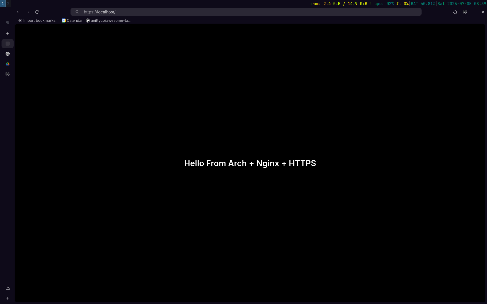

# Wireshark
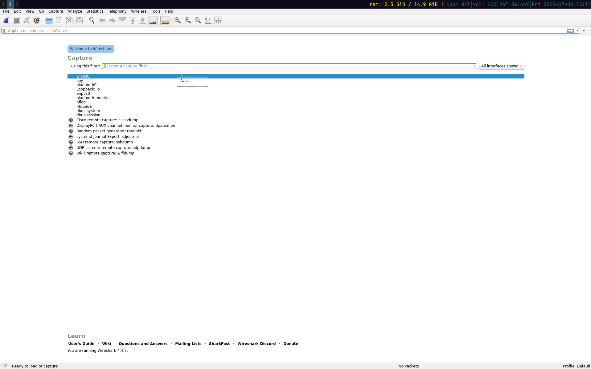
##### Visiting the `http://localhost` & `https://localhost`:
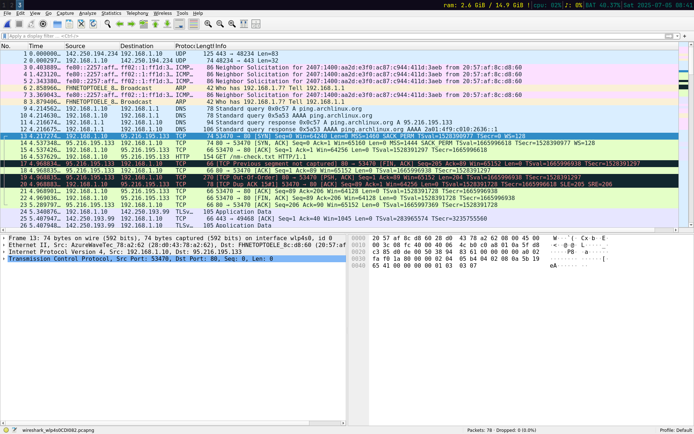
##### Filtering out packets on port `80` 
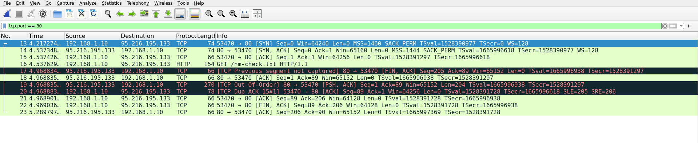
##### Filtering out packets on port `443` 
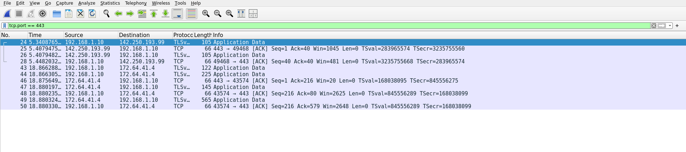
##### Inspecting a http packet:
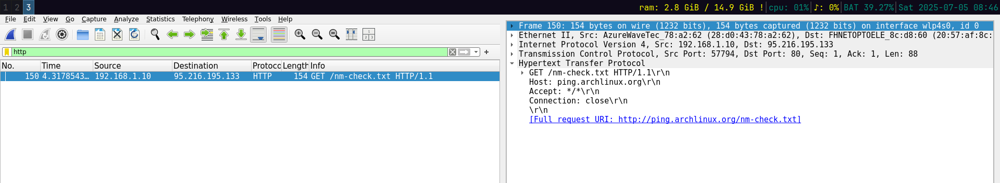

##### Inspecting TLS handshake:
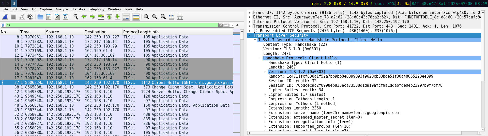

---

# Ngrok:

##### Creating an account:
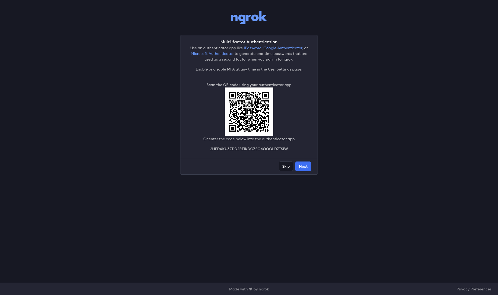
##### Installing ngrok from the arch user repository:

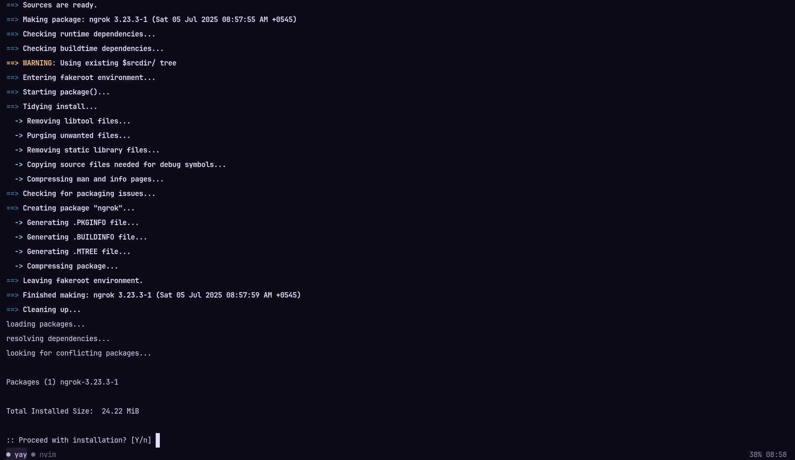

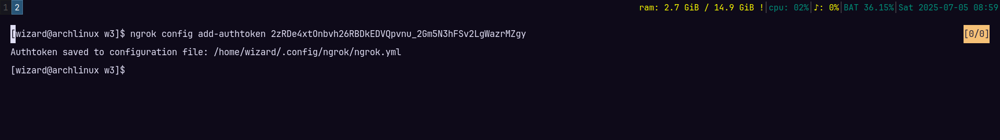

```bash
~
[wizard@archlinux w3]$ ngrok http https://localhost
```
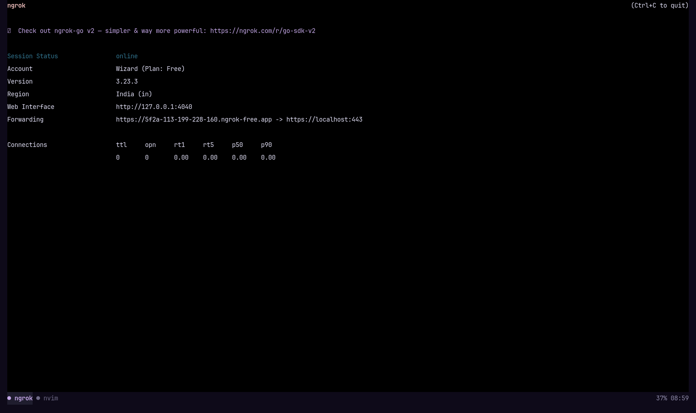
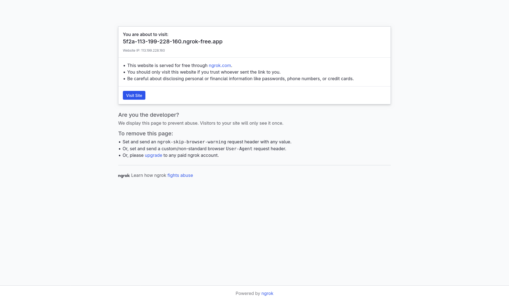

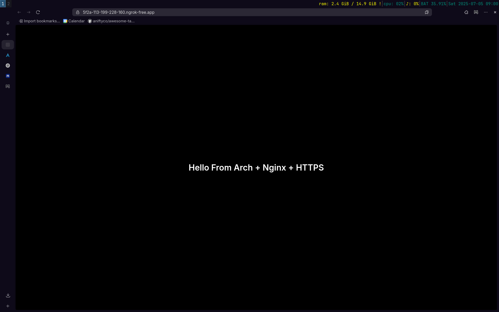


