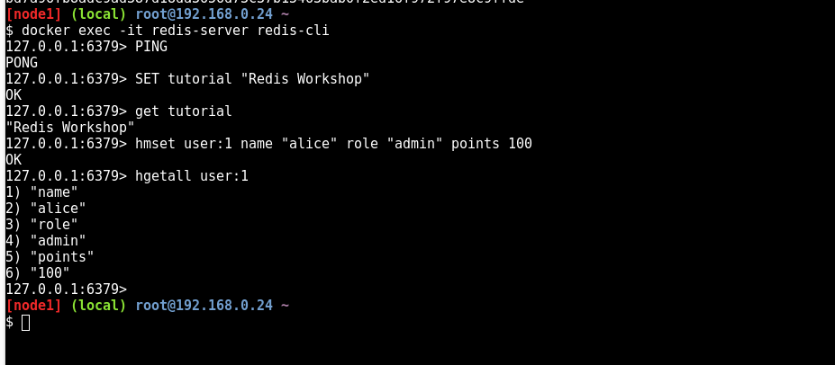
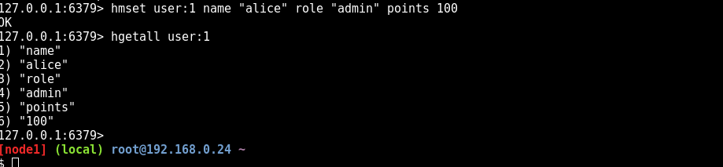
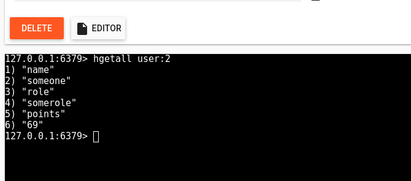
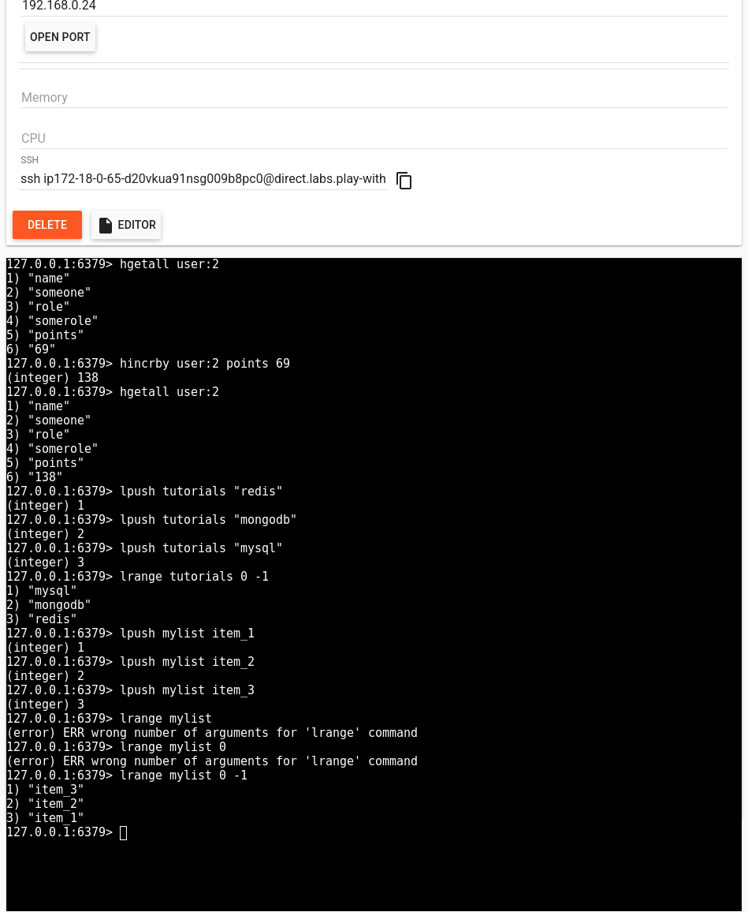
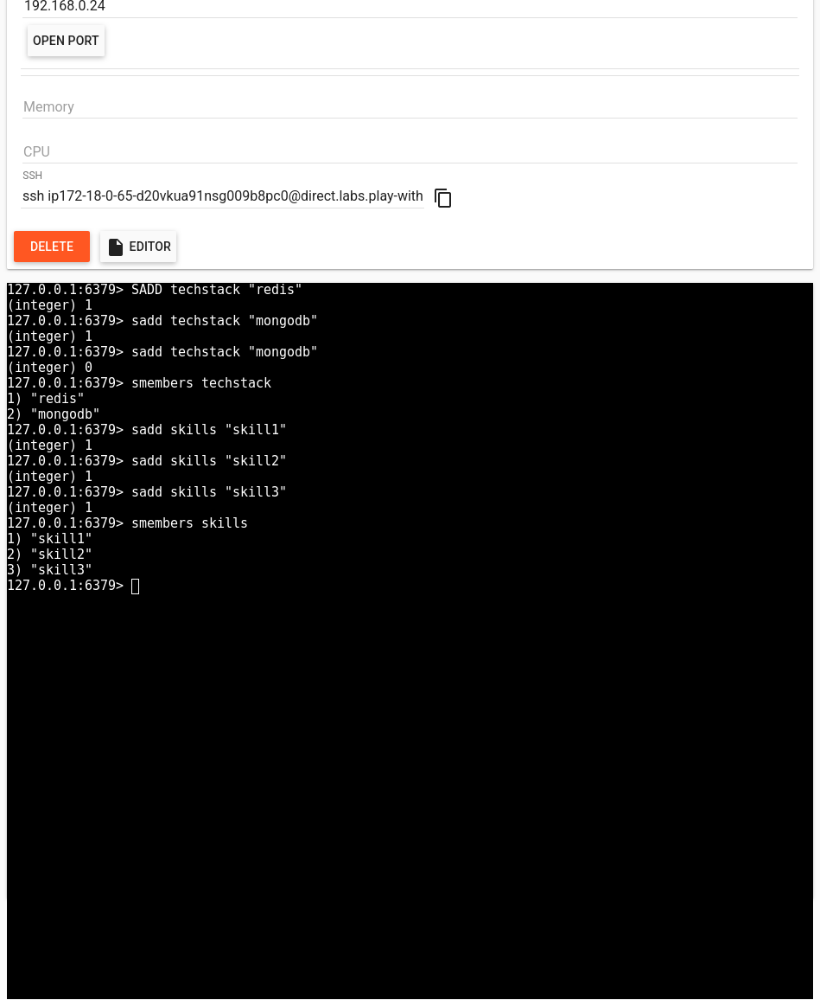
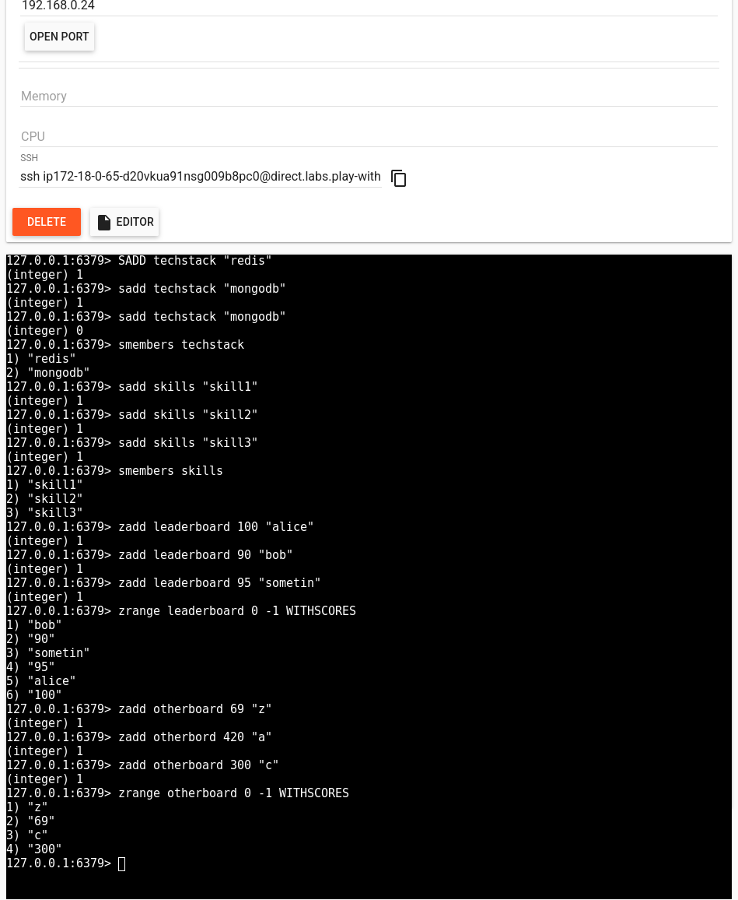
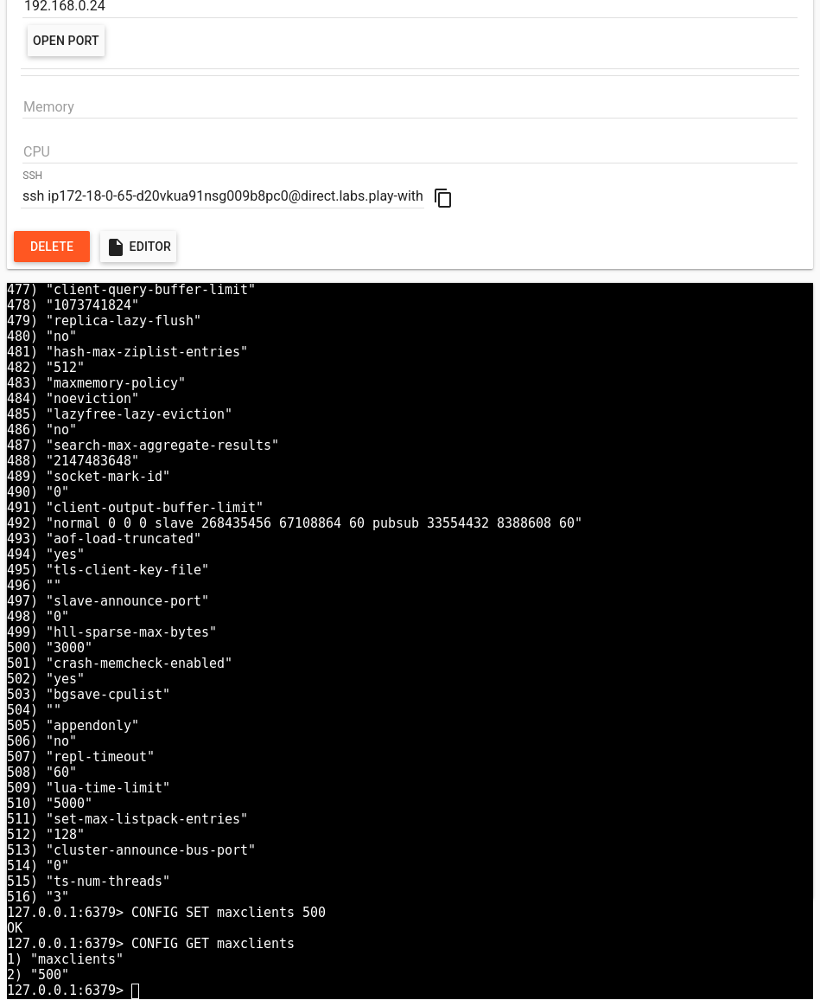
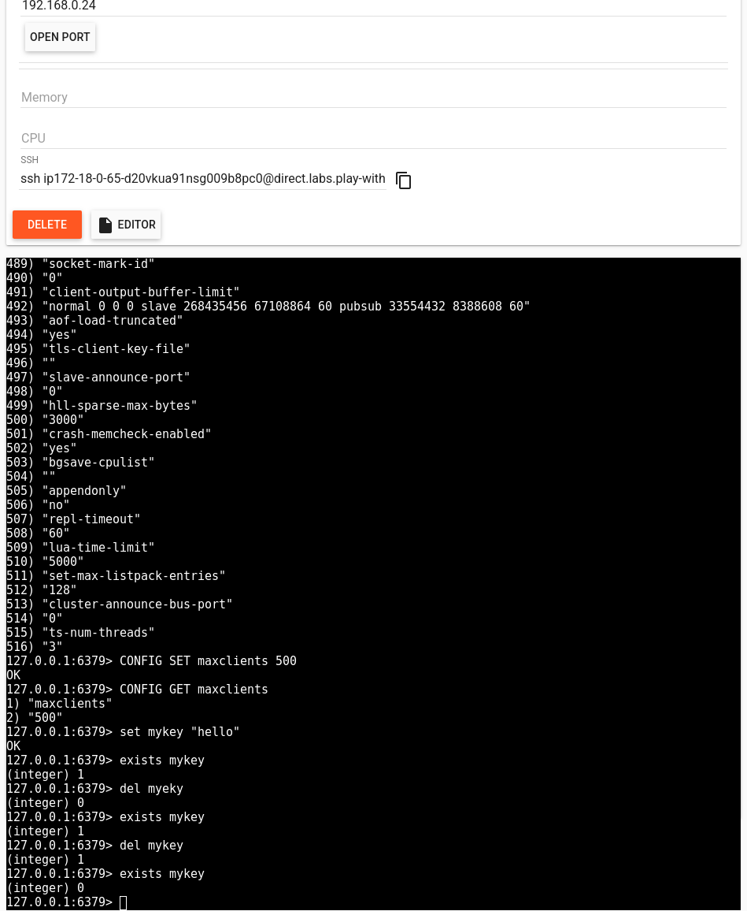

# Introduction:
Setup redis in play with docker using:

```
[node1] (local) root@192.168.0.24 ~
$ docker run -d --name redis-server -p 6379:6379 redis
Unable to find image 'redis:latest' locally
latest: Pulling from library/redis
59e22667830b: Pull complete 
563069fa03b4: Pull complete 
49031c033a72: Pull complete 
c645e9c24a26: Pull complete 
ab52a92c7961: Pull complete 
4f4fb700ef54: Pull complete 
550e4087f9e6: Pull complete 
Digest: sha256:f957ce918b51f3ac10414244bedd0043c47db44a819f98b9902af1bd9d0afcea
Status: Downloaded newer image for redis:latest
bd7a96fb8adc9ad387d18da3656d73c37b15463bab0f2ed16f972f97e8c9ffde
[node1] (local) root@192.168.0.24 ~
```

- Strings:

- Hashes:

    - Exercise: Creating another user `user:2`



### Lists:



### Sets:



### Ordered Sets:



### Redis Config


### Redis Key Management



