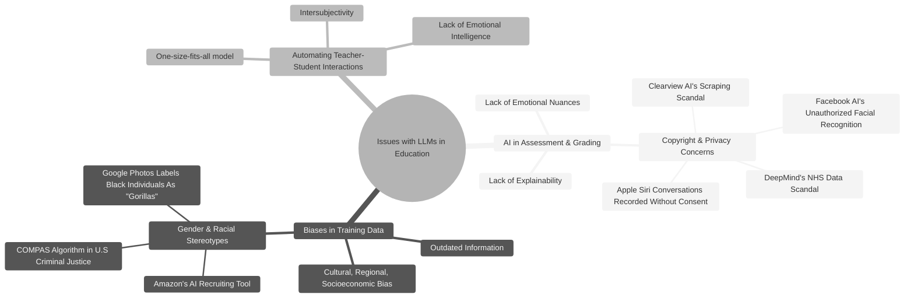

```mermaid
%%{init: {'theme':'neutral'}}%%
mindmap
  root((Issues with LLMs in Education))
    AI in Assessment & Grading
        Lack of Emotional Nuances
        Lack of Explainability
        Copyright & Privacy Concerns
            Clearview AI's Scraping Scandal
            Facebook AI's Unauthorized Facial Recognition
            DeepMind's NHS Data Scandal
            Apple Siri Conversations Recorded Without Consent
    Biases in Training Data
      Cultural, Regional, Socioeconomic Bias
      Outdated Information
      Gender & Racial Stereotypes
          Amazon's AI Recruiting Tool 
          COMPAS Algorithm in U.S Criminal Justice
          Google Photos Labels Black Individuals As "Gorillas"
    Automating Teacher-Student Interactions
        Intersubjectivity
        One-size-fits-all model
        Lack of Emotional Intelligence

```
