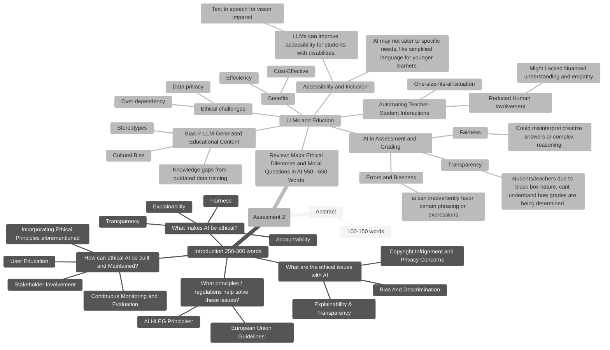

## About:
In this assignment, you are expected to write a comprehensive report on "AI: Balancing Innovation with Ethical Integrity: Opportunities and Challenges across various Fields". In the report you are expected to explore the ethical and moral constraints posed by the transformative power of modern AI-powered technologies and applications across various industries and fields.

[ Introduction ](./introduction.md)
>

# Ethical Implications of Bias in LLM-Generated Educational Content

## 1. Cultural and Regional Bias:
- **Issue**: LLMs may favor dominant cultural narratives, sidelining minority perspectives.
- **Example**: Historical events presented predominantly from a Western viewpoint.

## 2. Gender and Racial Stereotypes:
- **Issue**: Reinforcement of societal stereotypes through generated content.
- **Example**: Associating certain professions with specific genders or ethnicities.

## 3. Socioeconomic Bias:
- **Issue**: Content may assume access to resources not available to all students.
- **Example**: References to technologies or experiences common only in affluent societies.

>

# Automation of Teacher-Student Interactions

## 1. Over-reliance on AI:
- **Issue**: Over-reliance on AI for tutoring may diminish the role of educators.
  
## 2. Inaccuracies or Lack of Contextual Understanding:
- **Issue**: Potential inaccuracies or lack of contextual understanding in AI responses.
- **Example**: Misinterpretation of student queries leading to incorrect guidance.

## 3. Student Dependency on AI:
- **Issue**: Over-dependence on AI tools could reduce critical thinking and problem-solving skills.

>

# AI in Assessment and Grading

## 1. Bias in Grading:
- **Issue**: Ensuring AI grading systems are free from inherent biases.
- **Example**: AI misjudging creative or unconventional answers due to lack of contextual understanding.

## 2. Transparency in Evaluation Criteria:
- **Issue**: Difficulty in understanding how AI arrives at specific grades.
- **Example**: Lack of clear rationale behind AI-assigned scores.

>

# Data Privacy Concerns

## 1. Handling Sensitive Data:
- **Issue**: Handling of sensitive student information by AI systems.
- **Example**: Unauthorized access or misuse of student performance data.

>

# Strategies for Mitigating Ethical Concerns

## 1. Diverse and Inclusive Training Data:
- **Approach**: Incorporate a wide range of cultural, socioeconomic, and demographic data.
- **Benefit**: Reduces the risk of bias in AI-generated content.

## 2. Human-AI Collaboration:
- **Approach**: Use AI to augment, not replace, human educators.
- **Benefit**: Maintains the essential human element in teaching and assessment.

## 3. Regular Audits and Updates:
- **Approach**: Continuously monitor and refine AI systems to address emerging ethical issues.
- **Benefit**: Ensures AI tools remain fair, accurate, and aligned with educational goals.

## 4. Transparent AI Policies:
- **Approach**: Clearly communicate the role and limitations of AI in educational settings.
- **Benefit**: Builds trust among students, educators, and stakeholders.

