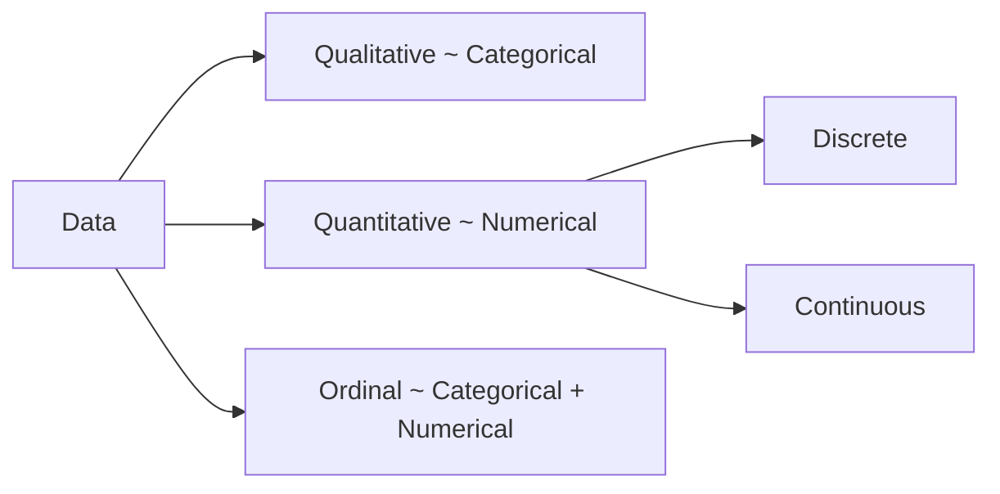
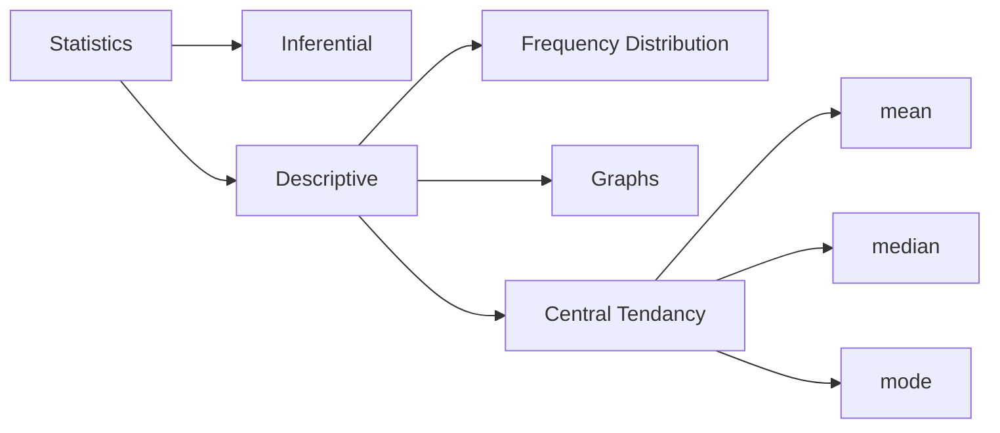

# Data:
Data is raw information—facts, figures, or symbols—collected for analysis, processing, or decision-making.

- __Qualitative__: cannot be expressed by a mathematical expression.

- __Discrete__: Positive Integers
- __Continuous__: Continuous Data includes values that can take on  __any number within a range__. Characterstics:
    - Can have infinite possible values within a range.
    - Often measured, not counted (e.g., height, weight, temperature, time).
    - Examples:
        - Height: 5.72 ft.
        - Temperature: 36.6°C.
        - Time: 4.53 seconds.

>

# Statistics: 
A branch of science dealing with the analysis of data

- __Inferential__ : Drawing Conclusion For Data, Used in things like Hypothesis testing.
- __Descriptive__ : Summarizing Data.

--- 

# Descriptive Statistics ~ ( Central Tendancy ):

## I. Mean:
The mean gives the __'center of gravity'__ for the dataset, but it is __sensitive to skewness caused by outliers.__
$$
\bar{x} = \frac{\sum (f_i \cdot x_i)}{N}
$$

Where, 
$f_i$ = Number of times $x_i$ has been repeated,
$x_i$ = The data point at $i$,
$N$ = The length of the dataset:

> 
## II. Median:
Median is the positional midpoint for a dataset. It is __less sensitive to skewness cause by outliers.__

### For Continuous Data:
$$
M_d = \left( \frac{n+1}{2} \right)^\text{th} \text{ term}
$$
or If dataset is even, 
$$
M_d = \left ( \frac{U + L}{2} \right)
$$

where,

U = The Upper Boundary Of One Half,
L = The Lower Boundary Of The Other Half 

If its odd, then its just the middle value.

__Example: For a dataset [ 1,2,3,4 ]:__

$
M_d = \left(\frac{2 + 3}{2} \right) = \frac{5}{4} 
$

Here, [1,2,3,4] -> [1,2], [3,4] -> 2 + 3 ( Upper boundary of [1,2] + Lower boundary of [3,4]) / 2

### For Grouped / Frequency Data, like (0-10,10-20, ...):

$$
M_d = L + \left ( \frac{\frac{n}{2}-CF}{f} \right) \cdot h
$$

Where,

$L$ = Lower Boundary of the __Median class__
$f$ = Frequency Of __Median Class__
$n$ = Sum Of All Frequencies
$CF$ = Cumulative Frequence __before the median class__
$h$ = Class width (the difference between the upper and lower boundaries of the __median class__)

__Example:__
|Class|Frequency|CF
|---|---|---|
0-10|5|5|
10-20|8|5 + 8 = 13|
20-30|12|5 + 8 + 12 = 25|
30-40|10|5 + 8 + 12 + 10 = 35|

> 
1. Total Frequency $(n) = 5 + 8 + 12 + 10 = 35$

2. Median Class = $\frac{n}{2} = \frac{35}{2} = 17.5 = 20-30$ ( as 17.5 lies within the class of 20-30)

3. $L = 20$ (Lower Boundary of the __median__ class) 

4. $CF = 13$ (Cumulative Frequency __before__ the __median class__)

5. $F = 12$ ( Frequency of the median class (20-30) in our case )

6. $h = upper - lower = 30 - 20 $ ( class width, upper-lower bounds of the __median class__ )

7. 
$$
M_d = L + \left ( \frac{\frac{n}{2}-CF}{f} \right) \cdot h
$$
$$
M_d = 20 + \left ( \frac{\frac{35}{2}-13}{12} \right) \cdot 20
$$
$$
M_d = 23.75
$$

## III. Mode:
The Data with the most frequency lmao very simple.

>
