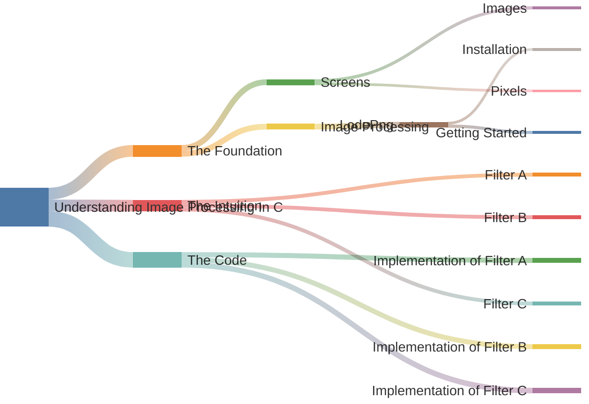

```mermaid
---
config:
  sankey:
    showValues: false
    nodeWidth: 50
    nodePadding: 40
    linkWidth: 10
---
sankey-beta

Understanding Image Processing In C,The Foundation,30
Understanding Image Processing In C,The Intuition,30
Understanding Image Processing In C,The Code,40

The Foundation,Screens,15
The Foundation,Image Processing,15
Screens,Images,8
Screens,Pixels,7
Image Processing,LodePng,15
LodePng,Installation,7
LodePng,Getting Started,8

The Intuition,Filter A,10
The Intuition,Filter B,10
The Intuition,Filter C,10

The Code,Implementation of Filter A,13
The Code,Implementation of Filter B,13
The Code,Implementation of Filter C,14
```
