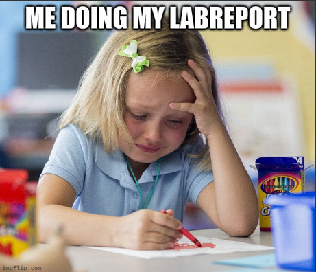
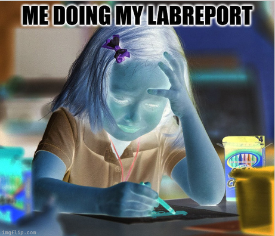
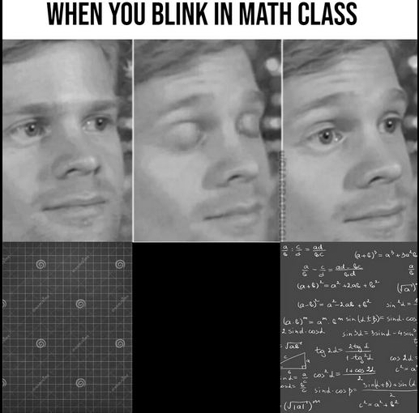
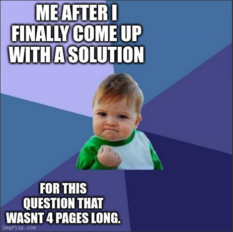
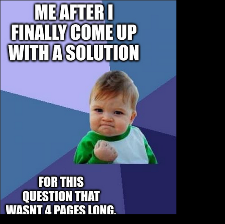
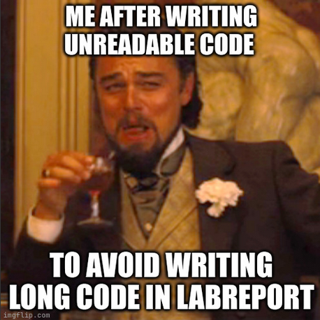
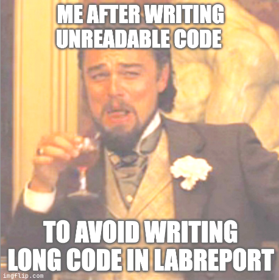
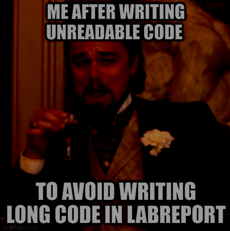

## Negative Filter:

---

## Greyscale Filter:

---

## WAP that blacks out pixels on the right and bottom edges of an image based on user input.

---

## WAP that brigtens or dims out image based on user input

---
