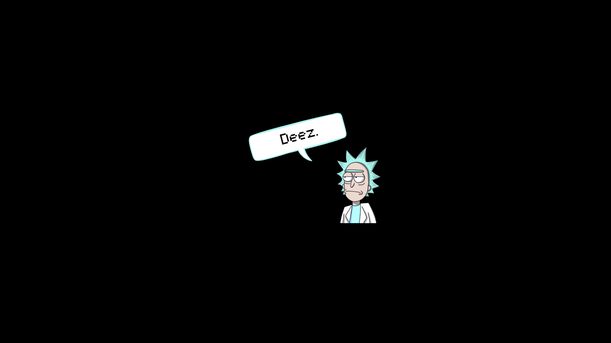
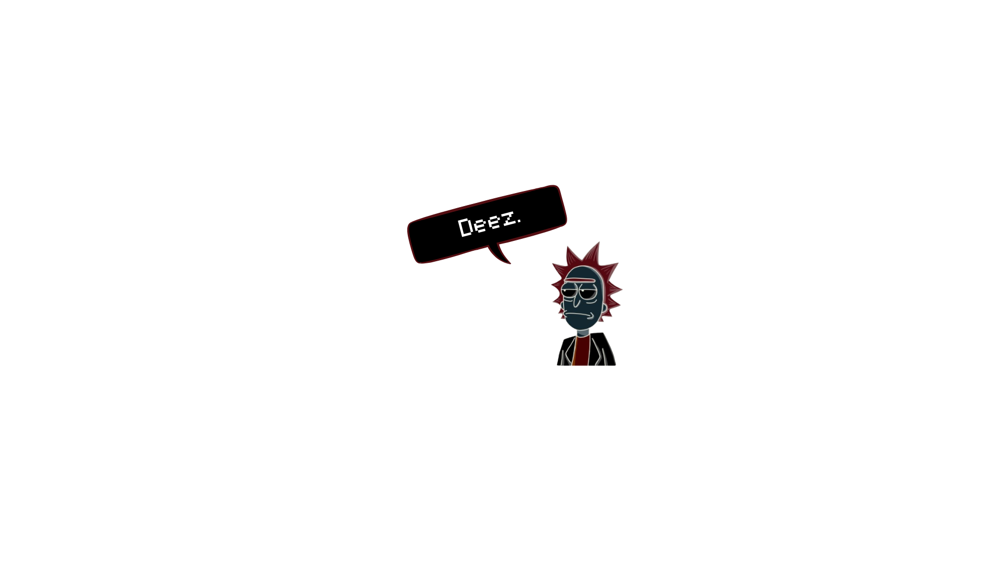
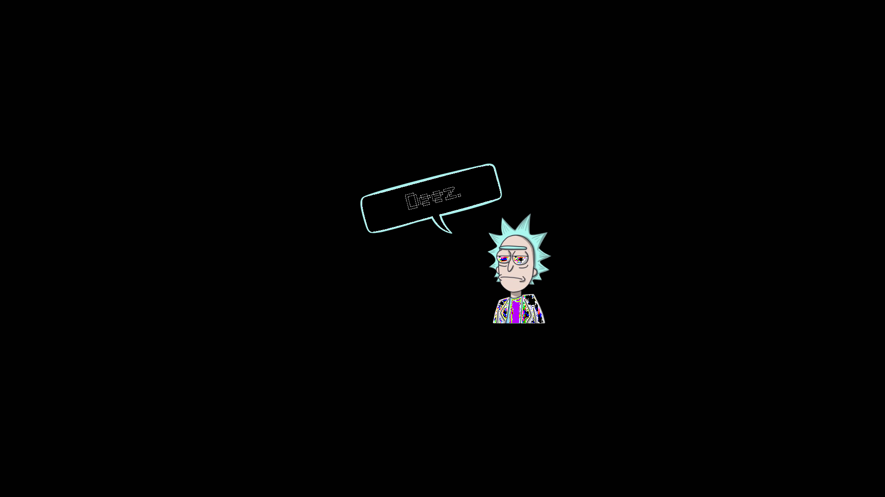

## Apply a negative filter on an image file. This is the process of reversing the RGB values. For example, if the Red value of the pixel is 100, the inverse is 155. NOTE: 0 is minimum and 255 is maximum. 
```c
~

#include <stdio.h>
#include <stdlib.h>
#include "../../lib/lodepng.h"

int main() {
    unsigned char *image;
    unsigned width, height;
    unsigned error;

    error = lodepng_decode32_file(&image, &width, &height, "../wallpaper.png");
    if (error) {
        printf("Decode error %u: %s\n", error, lodepng_error_text(error));
        return 1;
    }

    for (size_t i = 0; i < width * height * 4; i += 4) {
        image[i] = 255 - image[i];
        image[i + 1] = 255 - image[i + 1];
        image[i + 2] = 255 - image[i + 2];
        // transparency stays as is
    }

    error = lodepng_encode32_file("output.png", image, width, height);
    if (error) {
        printf("Encode error %u: %s\n", error, lodepng_error_text(error));
        free(image);
        return 1;
    }

    free(image); 
    return 0;
}
```
<div style="display:flex;">


</div>

>
## Write a program that reads an image file into a 1D array and converts it into a grayscale image. A color of gray is one in which Red=Green=Blue. Large values are white and small values are black. 
```c
~

#include <stdio.h>
#include <stdlib.h>
#include "../../lib/lodepng.h"

int main() {
    unsigned char *image;
    unsigned width, height;
    unsigned error;

    error = lodepng_decode32_file(&image, &width, &height, "../wallpaper.png");
    if (error) {
        printf("Decode error %u: %s\n", error, lodepng_error_text(error));
        return 1;
    }

    for (size_t i = 0; i < width * height * 4; i += 4) {
        int grey = (image[i] + image[i+1] + image[i+2])/3;
        image[i] = grey;
        image[i + 1] = grey;
        image[i + 2] = grey;
    }

    error = lodepng_encode32_file("output.png", image, width, height);
    if (error) {
        printf("Encode error %u: %s\n", error, lodepng_error_text(error));
        free(image);
        return 1;
    }

    free(image); 
    return 0;
}
```
<div style="display:flex;">


</div>
