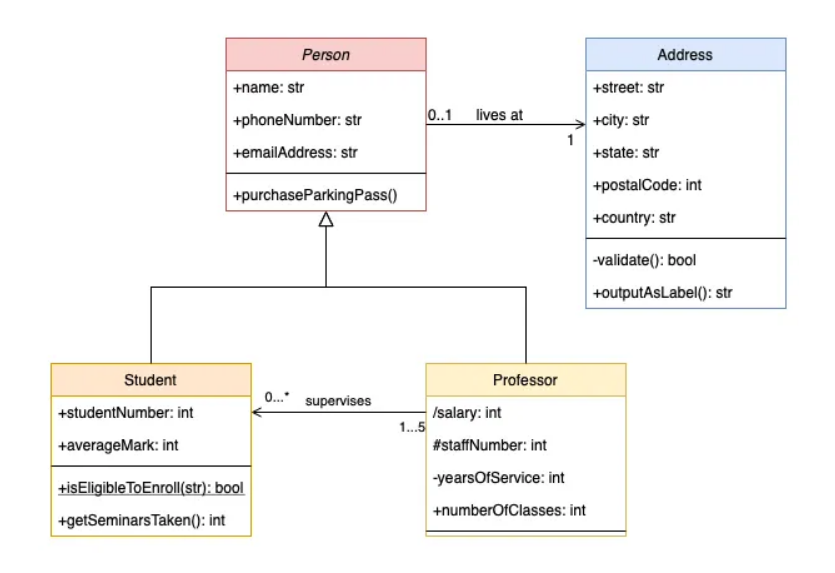
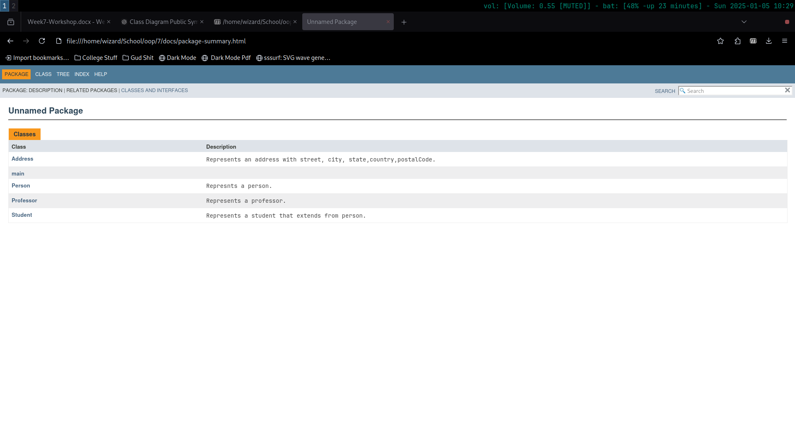
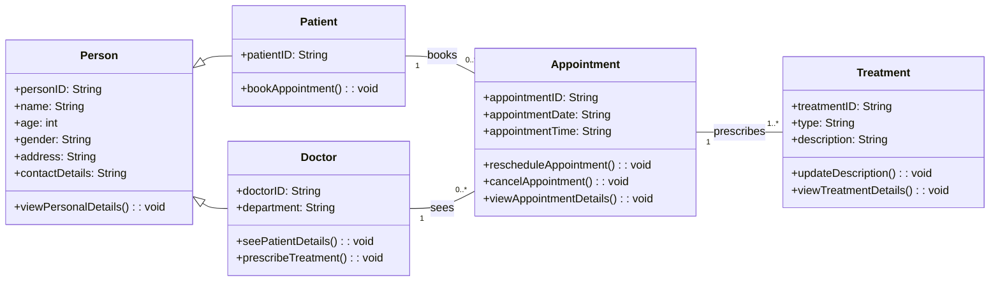
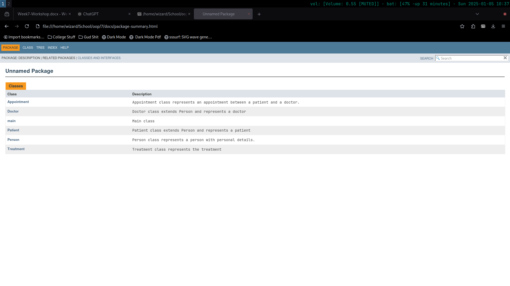
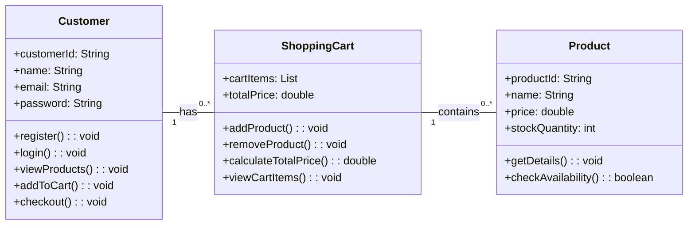
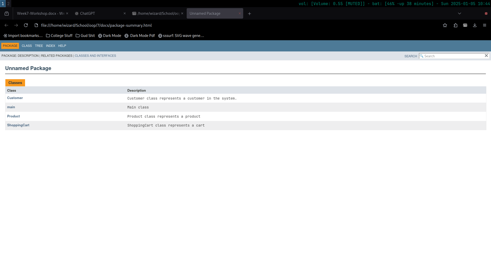

## Create classes and methods from the class diagram. Also, generate javadocs for them.
<div align="center">

</div>

```java
~
class Address {
    public String street, city, state, country;
    public int postalCode;
    public String outputAsLabel() { return String.format("%s, %s, %s, %d, %s", street, city, state, postalCode, country); }
    private boolean validate() { return true;}
}

class Person {
    public String name, phoneNumber, emailAddress;
    public void purchaseParkingPass(){ System.out.println("purchased"); }
}

class Student extends Person {
    public int studentNumber, averageMark;
    public boolean isEligibleToEnroll() { return averageMark >= 40; }
    public int getSeminarsTaken() { return 2;}
}

class Professor extends Person {
    protected int salary;
    public int staffNumber, yearsOfService, numberOfClasses;
    
    public Professor(int salary, int staffNumber, int yearsOfService, int numberOfClasses) {
        this.salary = salary; this.staffNumber = staffNumber; this.yearsOfService = yearsOfService; this.numberOfClasses = numberOfClasses;
    }
}

public class main {
    public static void main(String[] args) {
        Address address = new Address();
        address.street = "Some address"; address.city = "Kathmandu"; address.state = "KA"; address.postalCode = 12345; address.country = "Nepal";

        Student student = new Student();
        student.name = "John"; student.phoneNumber = "9841333333"; student.emailAddress = "someemail@gmail.com"; student.studentNumber = 1; student.averageMark = 69;

        Professor professor = new Professor(80000, 1001, 15, 5);
        professor.name = "Subash Sir"; professor.phoneNumber = "999999999"; professor.emailAddress = "someemail@gmail.com";

        System.out.println(student.name + "\n" + professor.name + "\n" + address.outputAsLabel());
    }
}
```
```
~

[wizard@archlinux 7]$ javac main.java && java main
John
Subash Sir
Some address, Kathmandu, KA, 12345, Nepal
[wizard@archlinux 7]$ 
```

>

# Case Study One: Hotel Management System

```java
~

/**
 * Person class represents a person with personal details.
 */
class Person {
    String personID;
    String name;
    int age;
    String gender;
    String address;
    String contactDetails;

    /**
     * Displays the personal details 
     */
    public void viewPersonalDetails() {
    }
}

/**
 * Patient class extends Person and represents a patient 
 */
class Patient extends Person {
    String patientID;

    /**
     * Books an appointment 
     */
    public void bookAppointment() { }
}

/**
 * Doctor class extends Person and represents a doctor 
 */
class Doctor extends Person {
    String doctorID;
    String department;

    /**
     * view details of patient.
     */
    public void seePatientDetails() { }

    /**
     * give treatment to  patient
     */
    public void prescribeTreatment() { }
}

/**
 * Appointment class represents an appointment between a patient and a doctor.
 */
class Appointment {
    String appointmentID;
    String appointmentDate;
    String appointmentTime;

    /**
     * Reschedules the appointment 
     */
    public void rescheduleAppointment() { }

    /**
     * Cancel appointment.
     */
    public void cancelAppointment() { }

    /**
     * View details of appointment.
     */
    public void viewAppointmentDetails() { }
}

/**
 * Treatment class represents the treatment 
 */
class Treatment {
    String treatmentID;
    String type;
    String description;

    /**
     * Updates the description of the treatment.
     */
    public void updateDescription() { }

    /**
     * View the details of the treatment.
     */
    public void viewTreatmentDetails() { }
}

/**
 * Main class 
 */
public class main {
    public static void main(String[] args) {
        Patient patient = new Patient(); Doctor doctor = new Doctor(); Appointment appointment = new Appointment(); Treatment treatment = new Treatment();
        
        patient.bookAppointment();
        doctor.seePatientDetails();
        doctor.prescribeTreatment();
        appointment.viewAppointmentDetails();
        treatment.updateDescription();
    }
}
```

>
# Case Study Two: E-Commerce Shopping Cart System

```java

import java.util.ArrayList;
import java.util.List;

/**
 * Customer class represents a customer in the system.
 */
class Customer {
    String customerId;
    String name;
    String email;
    String password;
    ShoppingCart cart;

    /**
     * Registers a new customer.
     */
    public void register() { }

    /**
     * Customer logs into the system
     */
    public void login() { }

    /**
     * Displays available products.
     */
    public void viewProducts() { }

    /**
     * Adds product to the shopping cart
     */
    public void addToCart(Product product) {
        cart.addProduct(product);
    }

    /**
     * Proceeds with checkout
     */
    public void checkout() { }
}

/**
 * Product class represents a product 
 */
class Product {
    String productId;
    String name;
    double price;
    int stockQuantity;

    /**
     * Displays product details.
     */
    public void getDetails() { }

    /**
     * Checks if the product is available 
     * @return true if available, false else
     */
    public boolean checkAvailability() { return stockQuantity > 0; }
}

/**
 * ShoppingCart class represents a cart
 */
class ShoppingCart {
    List<Product> cartItems = new ArrayList<>();
    double totalPrice;

    /**
     * Adds a product to the shopping cart.
     */
    public void addProduct(Product product) { cartItems.add(product); }

    /**
     * Removes a product from the cart.
     */
    public void removeProduct(Product product) { cartItems.remove(product); }

    /**
     * Calculates the total price of items 
     * @return total price.
     */
    public double calculateTotalPrice() {
        totalPrice = 0;
        for (Product product : cartItems) {
            totalPrice += product.price;
        }
        return totalPrice;
    }

    /**
     * Displays the items in the cart.
     */
    public void viewCartItems() { }
}

/**
 * Main class 
 */
public class main {
    public static void main(String[] args) {
        Customer customer = new Customer(); Product product1 = new Product(); ShoppingCart cart = new ShoppingCart();

        customer.addToCart(product1);
        customer.checkout();
        cart.calculateTotalPrice();
    }
}
```

