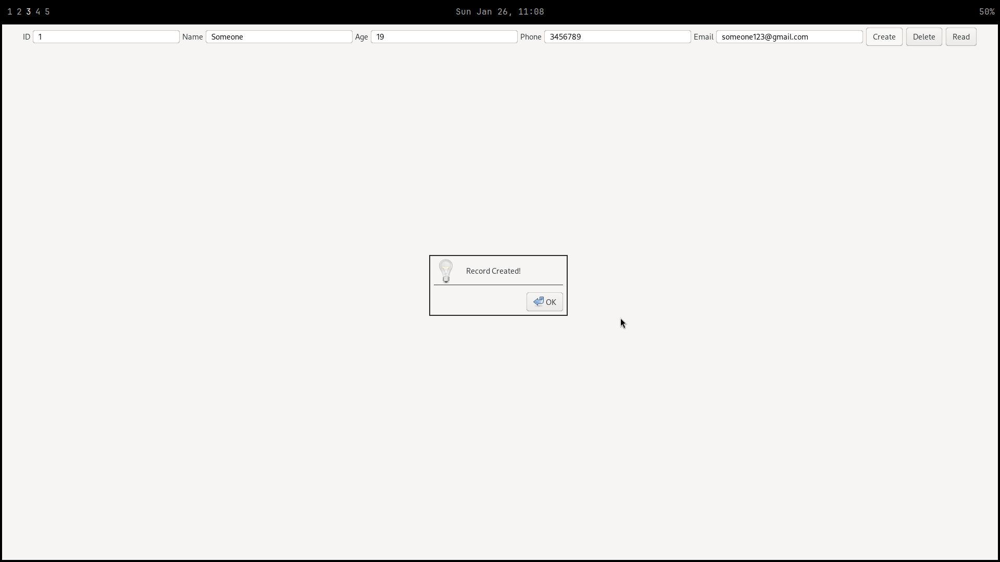
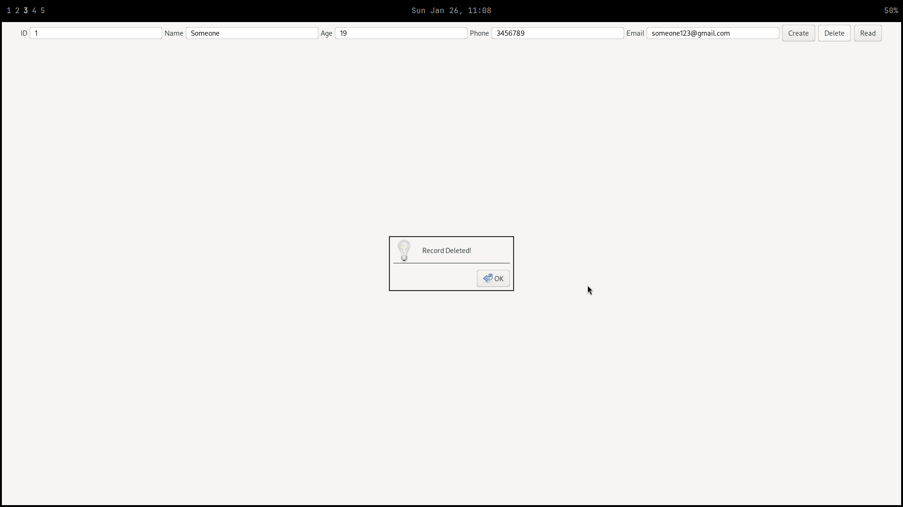
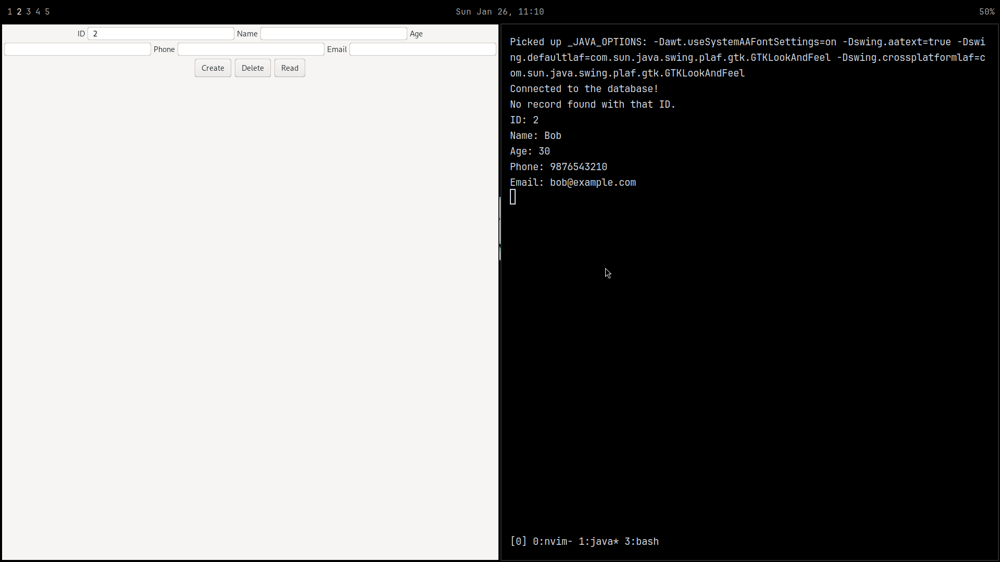
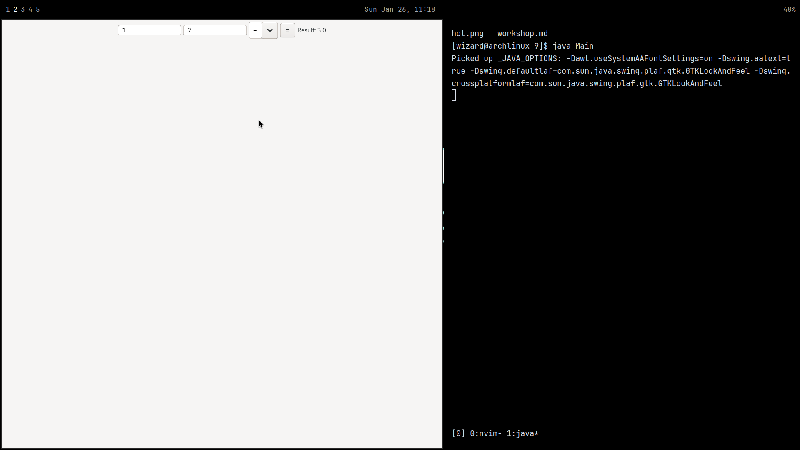
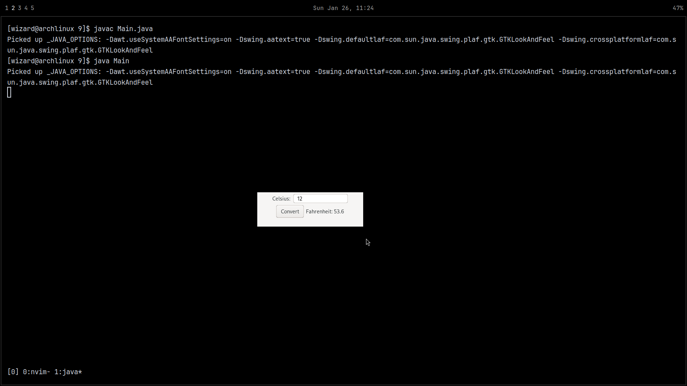

# Workshop 10:

## CRUD: 
```java
~
import javax.swing.*;
import java.awt.*;
import java.awt.event.*;
import java.sql.*;

public class Main {
    static final String URL = "jdbc:mysql://localhost:3306/jdbc"; 
    static final String USERNAME = "wizard";
    static final String PASSWORD = "godly123";
    
    static Connection connection = null;

    public static void main(String[] args) {
        JFrame frame = new JFrame("CRUD Operations");
        frame.setLayout(new FlowLayout());
        frame.setSize(400, 400);

        
        JLabel idLabel = new JLabel("ID");
        JTextField idField = new JTextField(20);
        JLabel nameLabel = new JLabel("Name");
        JTextField nameField = new JTextField(20);
        JLabel ageLabel = new JLabel("Age");
        JTextField ageField = new JTextField(20);
        JLabel phoneLabel = new JLabel("Phone");
        JTextField phoneField = new JTextField(20);
        JLabel emailLabel = new JLabel("Email");
        JTextField emailField = new JTextField(20);

        
        JButton createButton = new JButton("Create");
        JButton deleteButton = new JButton("Delete");
        JButton readButton = new JButton("Read");

        
        frame.add(idLabel);
        frame.add(idField);
        frame.add(nameLabel);
        frame.add(nameField);
        frame.add(ageLabel);
        frame.add(ageField);
        frame.add(phoneLabel);
        frame.add(phoneField);
        frame.add(emailLabel);
        frame.add(emailField);
        frame.add(createButton);
        frame.add(deleteButton);
        frame.add(readButton);

        frame.setDefaultCloseOperation(JFrame.EXIT_ON_CLOSE);
        frame.setVisible(true);

        
        try {
            connection = DriverManager.getConnection(URL, USERNAME, PASSWORD);
            System.out.println("Connected to the database!");

            
            createButton.addActionListener(e -> {
                String name = nameField.getText();
                int age = Integer.parseInt(ageField.getText());
                String phone = phoneField.getText();
                String email = emailField.getText();

                String query = "INSERT INTO users (name, age, phone, email) VALUES (?, ?, ?, ?)";

                try (PreparedStatement stmt = connection.prepareStatement(query)) {
                    stmt.setString(1, name);
                    stmt.setInt(2, age);
                    stmt.setString(3, phone);
                    stmt.setString(4, email);
                    stmt.executeUpdate();
                    JOptionPane.showMessageDialog(frame, "Record Created!");
                } catch (SQLException ex) {
                    ex.printStackTrace();
                }
            });

            
            deleteButton.addActionListener(e -> {
                String id = idField.getText();
                String query = "DELETE FROM users WHERE id = ?";

                try (PreparedStatement stmt = connection.prepareStatement(query)) {
                    stmt.setString(1, id);
                    stmt.executeUpdate();
                    JOptionPane.showMessageDialog(frame, "Record Deleted!");
                } catch (SQLException ex) {
                    ex.printStackTrace();
                }
            });

            readButton.addActionListener(e -> {
                String id = idField.getText();
                String query = "SELECT * FROM users WHERE id = ?";

                try (PreparedStatement stmt = connection.prepareStatement(query)) {
                    stmt.setString(1, id);
                    ResultSet rs = stmt.executeQuery();

                    if (rs.next()) {
                        System.out.println("ID: " + rs.getInt("id"));
                        System.out.println("Name: " + rs.getString("name"));
                        System.out.println("Age: " + rs.getInt("age"));
                        System.out.println("Phone: " + rs.getString("phone"));
                        System.out.println("Email: " + rs.getString("email"));
                    } else {
                        System.out.println("No record found with that ID.");
                    }
                } catch (SQLException ex) {
                    ex.printStackTrace();
                }
            });

        } catch (SQLException e) {
            e.printStackTrace();
        }
    }
}
```
<div style="">

</div>
<div style="">

</div>
<div style="">

</div>

>
## Create a calculator
```java
~

import javax.swing.*;
import java.awt.*;
import java.awt.event.ActionEvent;
import java.awt.event.ActionListener;

public class Main {
    public static void main(String[] args) {
        JFrame frame = new JFrame("Calculator");
        frame.setDefaultCloseOperation(JFrame.EXIT_ON_CLOSE);
        frame.setSize(300, 200);
        frame.setResizable(false);

        JTextField num1Field = new JTextField(10);
        JTextField num2Field = new JTextField(10);
        JComboBox<String> operationBox = new JComboBox<>(new String[]{"+", "-", "*", "/"});
        JButton calculateButton = new JButton("=");
        JLabel resultLabel = new JLabel("Result: ");

        frame.setLayout(new FlowLayout());
        frame.add(num1Field);
        frame.add(num2Field);
        frame.add(operationBox);
        frame.add(calculateButton);
        frame.add(resultLabel);

        calculateButton.addActionListener(new ActionListener() {
            @Override
            public void actionPerformed(ActionEvent e) {
                try {
                    double num1 = Double.parseDouble(num1Field.getText());
                    double num2 = Double.parseDouble(num2Field.getText());
                    String operation = (String) operationBox.getSelectedItem();
                    double result = 0;

                    switch (operation) {
                        case "+": result = num1 + num2; break;
                        case "-": result = num1 - num2; break;
                        case "*": result = num1 * num2; break;
                        case "/": 
                            if (num2 != 0) result = num1 / num2; 
                            else throw new ArithmeticException("Division by zero");
                            break;
                    }
                    resultLabel.setText("Result: " + result);
                } catch (NumberFormatException ex) {
                    resultLabel.setText("Invalid input");
                } catch (ArithmeticException ex) {
                    resultLabel.setText(ex.getMessage());
                }
            }
        });

        frame.setVisible(true);
    }
}
```
<div style="">

</div>


>
## Temperature Converter
```java
~

import javax.swing.*;
import java.awt.*;
import java.awt.event.ActionEvent;
import java.awt.event.ActionListener;

public class Main {
    public static void main(String[] args) {
        JFrame frame = new JFrame("Celsius to Fahrenheit");
        frame.setDefaultCloseOperation(JFrame.EXIT_ON_CLOSE);
        frame.setSize(300, 100);
        frame.setResizable(false);

        JTextField celsiusField = new JTextField(10);
        JButton convertButton = new JButton("Convert");
        JLabel resultLabel = new JLabel("Fahrenheit: ");

        frame.setLayout(new FlowLayout());
        frame.add(new JLabel("Celsius: "));
        frame.add(celsiusField);
        frame.add(convertButton);
        frame.add(resultLabel);

        convertButton.addActionListener(new ActionListener() {
            @Override
            public void actionPerformed(ActionEvent e) {
                try {
                    double celsius = Double.parseDouble(celsiusField.getText());
                    double fahrenheit = (celsius * 9 / 5) + 32;
                    resultLabel.setText("Fahrenheit: " + fahrenheit);
                } catch (NumberFormatException ex) {
                    resultLabel.setText("Invalid input");
                }
            }
        });

        frame.setVisible(true);
    }
}
```

<div style="">

</div>

>

